In this step, we will deploy the first environment and see it running.

# Application

## Build

The images were pre-built and pulled during the setup of this VM, so there is no need to build them as it takes quite some time.
Running `docker images` we should be able to see all the images we need.

Though, there is one image we will rebuild later with the following command: the discount service.

```
docker build -t discounts-service discounts-service
```

## Deploy

Now let's deploy!
We setup a fake CI/CD environment, so to deploy, you'll only need to run `git push deploy`{{execute}}.

```
git push deploy
```

Once everything is running, you should be able to visit the store by clicking on `storedog` in the tabs.

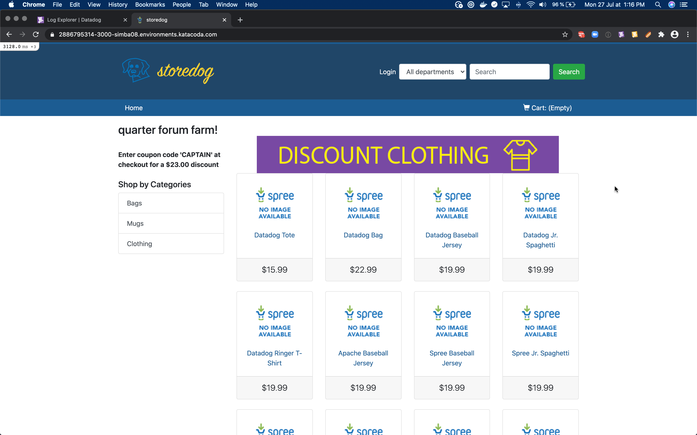

> For the curious among us, the `deploy` remote is just a bare local repository which allow to use the `pre-push` hook to launch a deployment script which simply run `docker-compose`.

# Datadog agent

## API keys

In order to authenticate and send data, the datadog agent will need the API key from the datadog account receiving the data.

We can find this API key in the Integration menu, within the APIs entry.
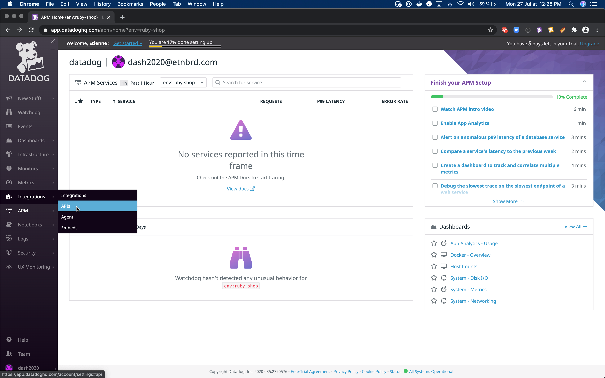

Once in APIs tab of the Integration screen, the API Key is in the first revealing section.
The API key is masked at first, but will reveal when hovering the mouse.
It's possible to double-click to select and copy it to paste it later in the terminal.
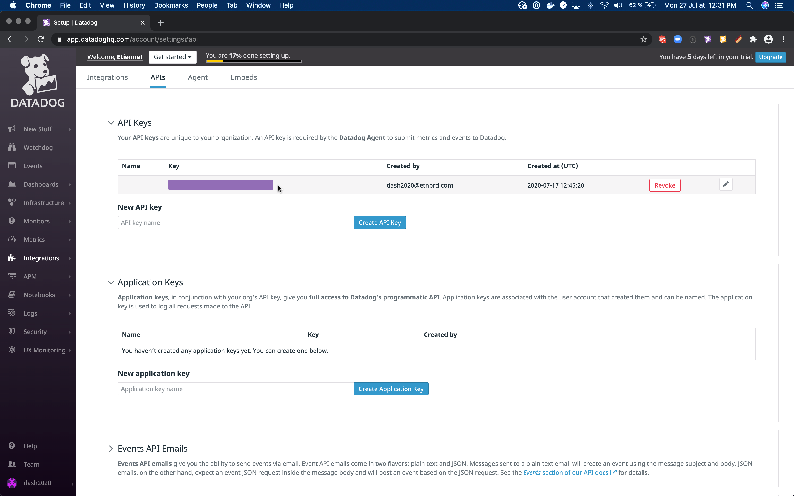
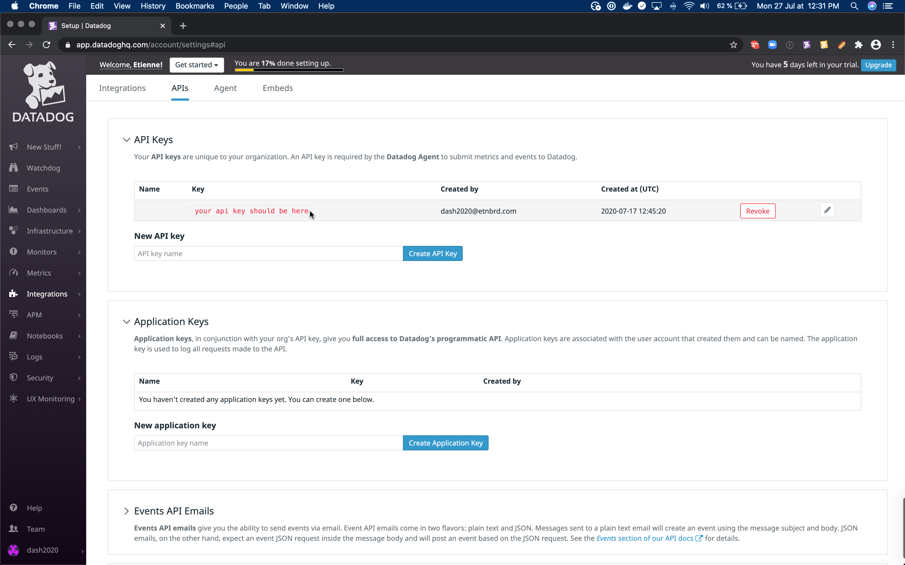

The datadog agent will expect this API key to be available under the `DD_API_KEY` environment variable.
So we can simply export this variable to be available throughout our session.

```
export DD_API_KEY=<your api key>
```

For the agent to take into account this key, we need to restart the application.
`docker-compose -p prod restart`{{execute}}

## See Traffic in Datadog

The application is now running and instrumented, we should be able to see some traffic in datadog.

Some logs are sent to datadog each time a user is browsing the ecommerce app.
[Logs: https://app.datadoghq.com/logs](https://app.datadoghq.com/logs)
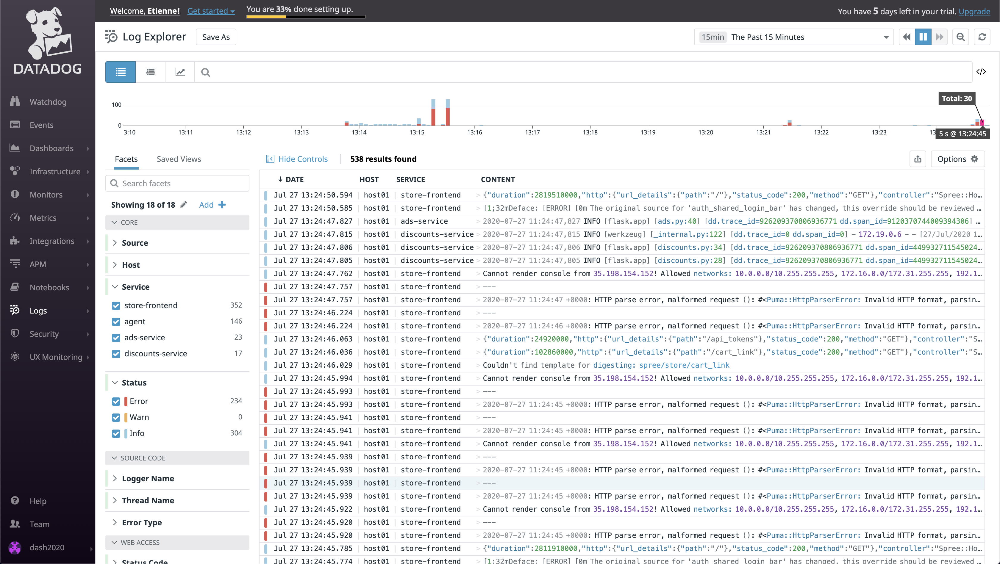

The different services are instrumented and available individually in APM.
[Service list: https://app.datadoghq.com/apm/services](https://app.datadoghq.com/apm/services)


Datadog even builds a map of the different services to understand their interactions.
[Service map: https://app.datadoghq.com/apm/map](https://app.datadoghq.com/apm/map)


# UX Monitoring

The datadog agent can monitor and send metrics from our backend, but it's not aimed at understanding the user experience.
To do so, datadog provide two tools: Real User Monitoring (RUM) and Synthetics.
The former captures all interactions from users, and help to catch unexpeced issues.
The latter replays critical user interactions to make sure the application is behaving correctlu.

## Setup RUM application

RUM is already integrated within the frontend of our application, and similarly to the datadog agent, we just need to provide it with the right keys to start the monitoring.

Let's create a RUM application to monitor our frontend.
If we had a backoffice, or a mobile application, that could be a different RUM application.

The RUM tool is under the UX Monitoring menu.
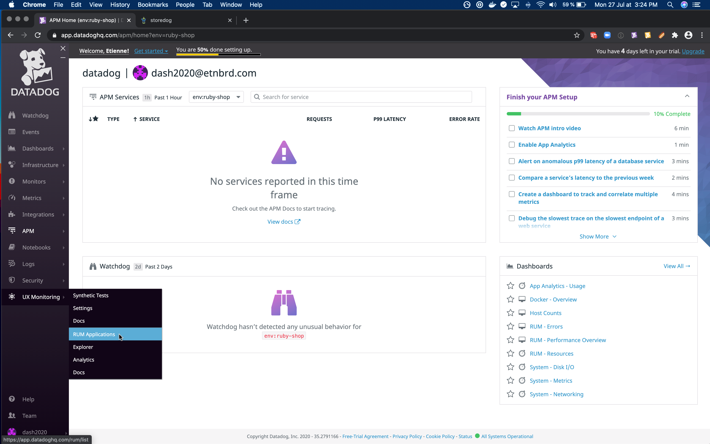

We should be prompted to create and name an application.
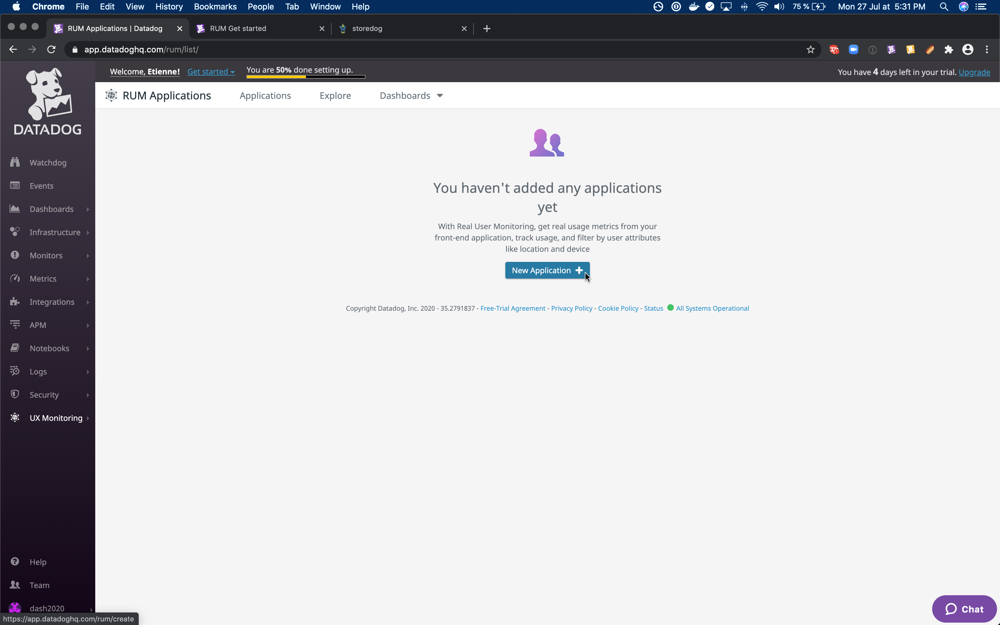
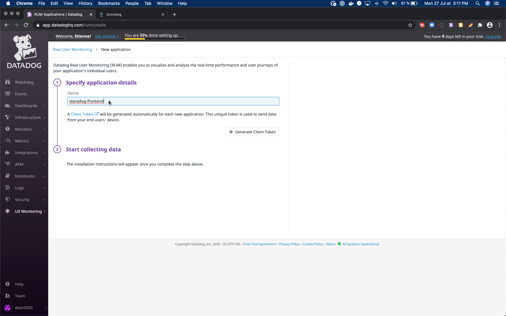

This application has a specific id and client token we need to provide as environment variables.
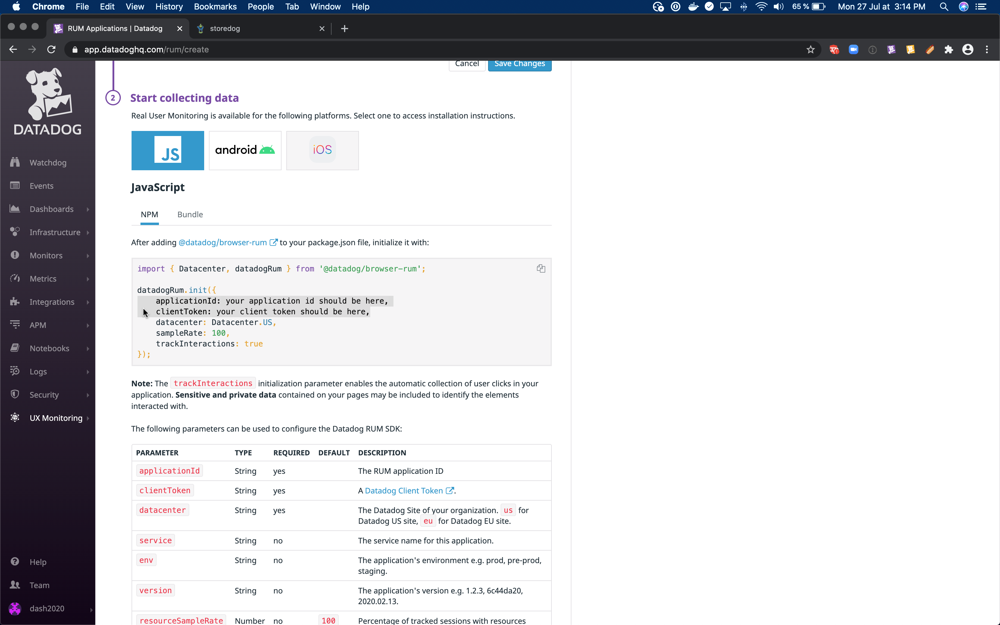

```
export DD_APPLICATION_ID=<your application id>
export DD_CLIENT_TOKEN=<your client token>
```

For the frontend to take into account these keys, we need to restart the application.
`docker-compose -p prod restart`{{execute}}

## See RUM Traffic in Datadog

Once everything is running with the right tokens, we should be able to see some user data being reported to RUM.
> TODO can't make it work for now.

## Setup Synthetics

While we're at it, let's setup everything we will need for later.

As stated above, Synthetics is the counter-part to RUM. When RUM collects directly data, while Synthetics helps us make sure specific user path are always available.

The Synthetics tool is under the UX Monitoring menu, like RUM.
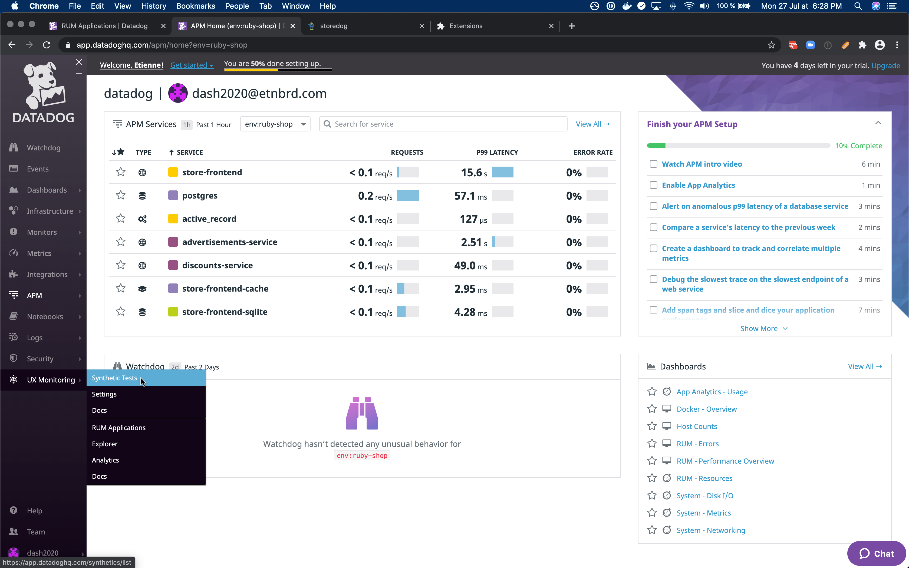

The first time, we might be greeted by a welcome screen to explain what UX Monitoring, RUM and Synthetics are. Let's browse past that for now.
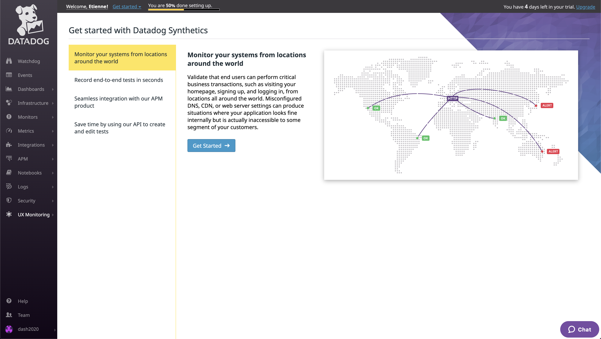

It'll ask us to create a first synthetics test.
If there isn't the greeting followed by the creation pop-up, there is button on the top right corner to create a test.
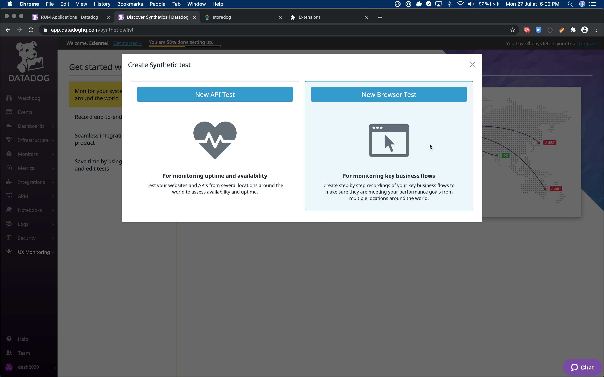

We only need to fill the url, the name and the location from which to run the test.
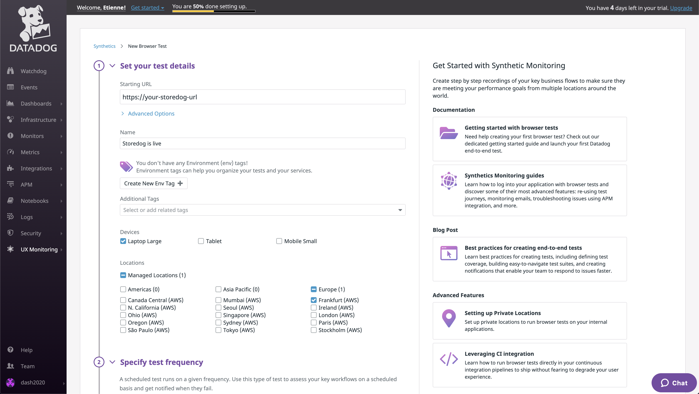

Then we can scroll to the bottom and start recording the test.
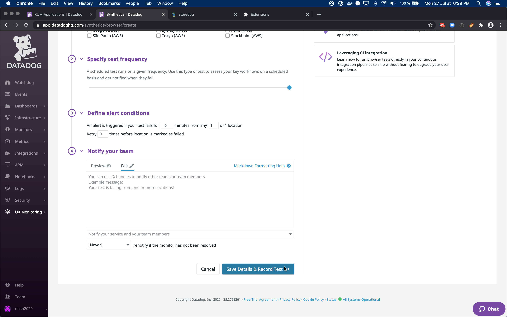

While recording a synthetics test, we catch all interactions with the page in the recorded tab. To do so correctly, we need to install an extension in the browser.
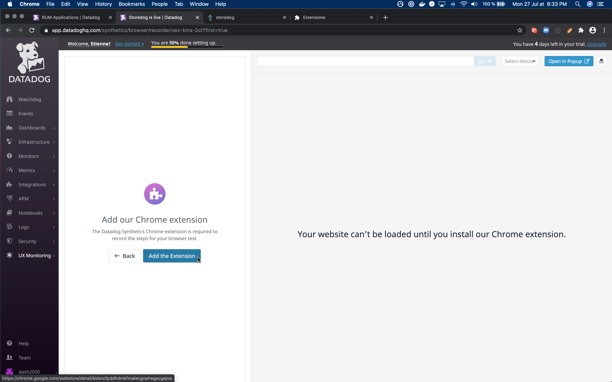

[Datadog Synthetics Chrome Extension](https://chrome.google.com/webstore/detail/datadog-test-recorder/kkbncfpddhdmkfmalecgnphegacgejoa)

This extension is only available for Chrome for now.
>Firefox users: let us know if you are interested in having it ported, in order to help with its prioritization.

Once the extension is installed, we can record our first test.
We'll just make an assertion, to make sure an element is present on the page.
If the logo is there, it's probably enough to ensure the site is live.

> TODO let's just move the first test creation from step 3 here.