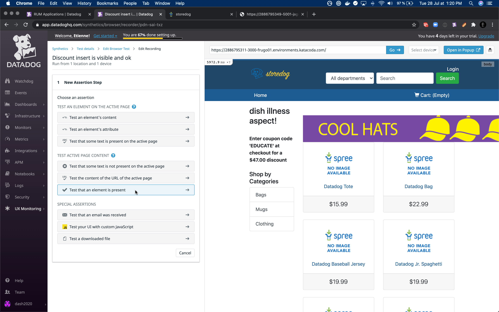

With the increasing scale of software systems, testing after each change to catch regressions will become longer and more tedious.
Imagine browsing all the critical paths of your application to make sure they are still behaving correctly.
At some point, it won't realistically be done manually.
Let's see how to automate these tests with end-to-end testing and monitoring.

# Synthetics Test

Let's imagine the marketing team published a report showing that the discounts insert is driving 83% of the site's revenue.

It's definitely something we don't want to miss, let's record a test to make sure it doesn't break!

We already recorded a very simple test during the setup.
We are now going to push things further to test the discount insert from our application.

## Discount insert is present

The test we are going to record is still fairly simple: we will make sure the element containing the discount code is present in the page.

First let's create an assertion by clicking on the _Assertion_ button.
It might come off obvious but it's always good to remind: tests should always contain at least one assertion, and finish on an assertion.

We are going to assert the discount insert is visible by making sure its element is present on the page.
Let's click on _Test that an element is present_.

Then, we are asked to select which element should be present on the page.
Let's click on the element containing the discount code.

And done, we just created our first assertion that the discount code is visible.

Let's see that this test is working.
We can save the test by clicking on the button "Save & launch the test" at the very bottom of the page.

And after a couple minutes, we should see our first results coming in.
The test is live and seems to be working!

You might have noticed that the content of the element is always changing, and yet we still manage to find it in the page.
Our localization algorithms uses various strategies to locate an element. Some of them are based on the content of the element, but not all.
So if the text of the element is changing, the other localization strategies can take lead. And if the element is moving in the DOM, or if its `id` or `class` are changing, the content-based strategies can take lead to always find the right element.
And if the element is detected to be modified, all the strategies are updated automatically so that all the strategies are working for the next test.

## Discount insert is displayed as expected

Let's dive in a bit deeper and record a test to make sure the discount code actually displayed as expected.

Let's create a new step in our existing test.
Click on the cog, in the top right corner, and then on _Edit recording_

We are now back in the steps list, and ready to record our new step.
Let's click again on the assertion button, but now, let's choose _Test an element's content_.

We choose again the same element containing the discount code, and we would like to test that its content is what we expect, even though it's changing every time.
We can use the regex assertion.

We want the discount code to be between 3 to 8 letters.
`^Enter coupon code '[A-Z]{3,8}' at checkout`{{copy}}

Let's save and check that our test is still green.

## Discount code is valid

The discount code matched by the regex could be anything, though, right?
Let's see some more advanced technique to make sure the code is valid.

We will create two more steps:
1. the first one will extract the discount code into a local variable using Javascript, and
2. the second one will make an http request to the discount service to make sure the code from the variable is valid.

### Extract the discount code

Let's edit the recording again by clicking on the cog, then _Edit recording_.
Then, we can add a new variable extraction step by clicking on the _Variables_ button.

We choose to create our variable from Javascript in the dropdown, and name it `CODE`.

A few explanations on the different variables:
- Pattern: create random values, that are helpful to randomly fill fields and forms and then check their value afterwards.
- Element: create a value from the content of an element. We won't use that as we need only a part of the content.
- Global variable: 
- Email: 

We want to extract the value from a specific element — the discount insert — so let's select this element, like in the previous steps.

And to finish, we will write some code to extract the code from the element content.
We can use the same regex from the previous step, but with a capturing group using parenthesis `(...)`. The rest of the code is just getting the value of the captured group and returning it to fill the variable.
<pre class="hljs file" data-target="clipboard">
const regex = /^Enter coupon code '([A-Z]{3,8})' at checkout/
const [full, code] = element.innerText.match(regex)
return code
</pre>

And we should be all good, and have the code extracted successfully!

### Validate the discount code

Now that we have the discount code extracted into a variable, let's make sure it's a valid code according to the discount service.
For this, we are going to use an HTTP request step inside our browser test, to query directly the discount service, and make an assertion on the presence of the extracted code in the returned valid code.

Let's create an HTTP request step by clicking on the _HTTP Request_ button.

It asks us an URL for the service to query.
This url is the same as storedog, **except we replace 3000 with 5001 (the url-coded port), and it ends with `/discount`**
The `/discount` endpoints returns all the available discount codes.
And we will check that the extracted code is available within the returned codes.

We can click on the _Test the url_ button to make sure the service is live and responding.
And we should see the result and status of the request.
Some assertions are pre-filled with default sane values.
We can add our own by clicking the _Add assertion_ button. 

Our assertion holds on the body of the request.

And this body should contains the value of the extracted code, so we use the previously extracted variable `CODE` as the value to check for this assertion.

After validation, we can see this fourth step in our test.

We can _Save & Quit_ to exit back on the details page of the test.
Then, we can click the _Run Test Now_ button, in the top right corner, to trigger the test to run immediatly, instead of waiting the next scheduling.

And after a couple of minute, our test should be executed, and still passing.
By clicking on the step result of the HTTP Reuqest step, we can see all the details of the http request, and our custom assertion.
In the following screen shot, we can see that the extracted value at step 3 is `FLASH`, and our assertion at step 4 is that the body contains `FLASH`. It's passing so the code must be valid.

