Welcome to the development environment we are going to use for this workshop!

Before starting, make sure the terminal on the right finishes running the setup and displays "Done".

# Application

In this step, we will deploy the first environment and see it running.
This `storedog` application is composed of a few Docker images, including the Datadog Agent.
The Datadog API key associated with your trial account should already be exported as an environment variable for the Agent to use:

`echo $DD_API_KEY`{{ execute }}

A Datadog Application key should already be available as well.
Datadog clients, such as the Datadog CI we are going to use later on, requires the app key.

`echo $DD_APP_KEY`{{ execute }}

## Build

The images were pre-built and pulled during the setup of this VM, so there is no need to build them as it takes quite some time.
To see the required images, run:

`docker images`{{ execute }}

There is one image we will rebuild later: the discounts service.

```
docker build -t discounts-service discounts-service
```

## Deploy

Now let's deploy!
This workshop environment contains a fake CI/CD pipeline, so to deploy, we'll only need to run `git push deploy`{{ execute }}.

Once everything is running, you should be able to visit the store by clicking on `storedog` in the tabs.

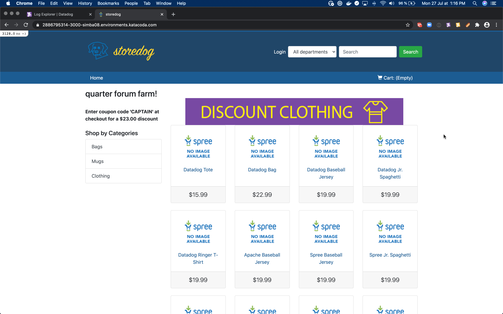

> For the curious among us, the `deploy` remote is just a bare local repository that allows us to use the `pre-push` hook to launch a deployment script that runs `docker-compose`. We can see the running services with `docker-compose ps`{{ execute }}

<!-- 

# Datadog agent

## API and APP keys

To authenticate and send data, Datadog clients need the API and the App key from your Datadog account.

Find these keys in the Integration menu, in the APIs entry.
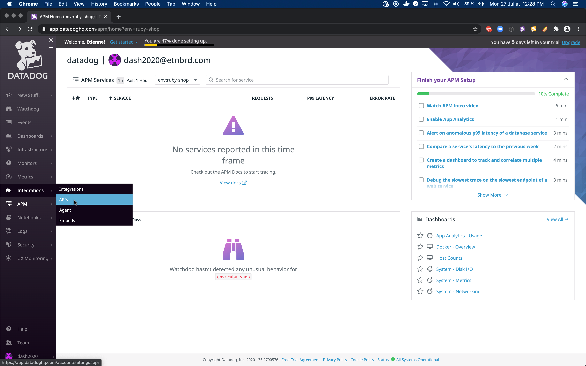

### API key

Once in the _APIs_ tab of the _Integration_ section, the API Key is in the first revealing section.
The API key is masked at first but reveals itself on a mouse hover.
Let's double-click to select and copy it to paste it later in the terminal.
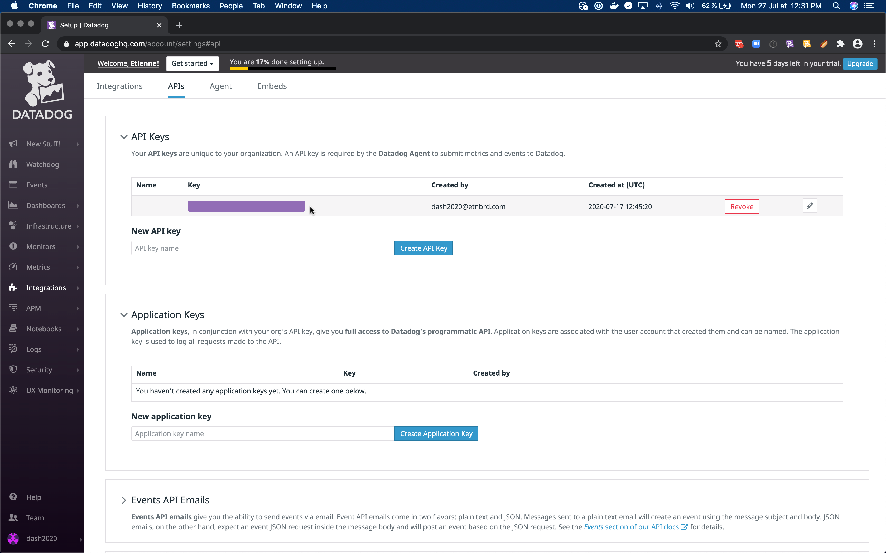
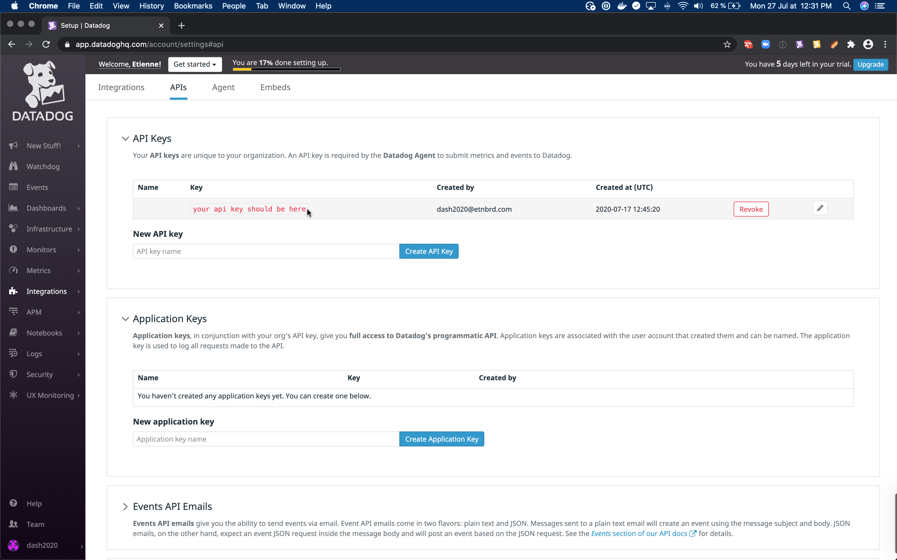

The datadog Agent expects this API key to be available under the `DD_API_KEY` environment variable.
So we can export this variable to be available throughout our session.

```
export DD_API_KEY=<your API key>
```

### APP key

The Application keys are available in the second revealing section.
We need to create a new App key for this workshop.
This App key is required for Synthetics CI later on, so let's just call it `synthetics-ci`.
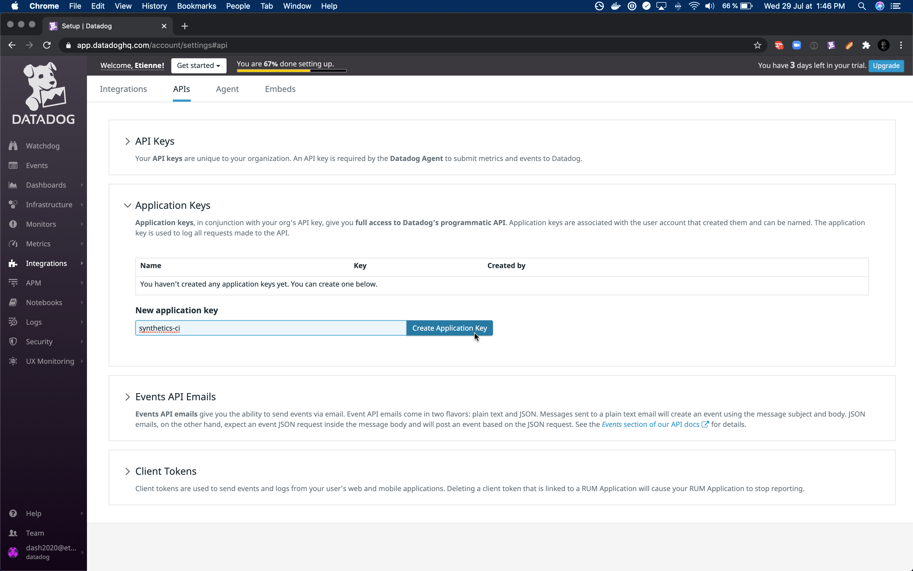

Once you create the App key, it's available exactly like the API key.
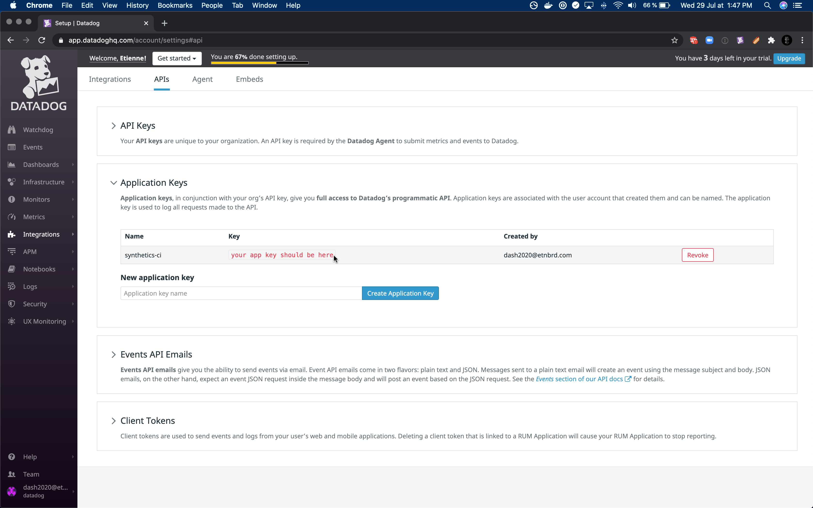

We can export it as an env variable, like the API key.

```
export DD_APP_KEY=<your app key>
```

For the Agent to take into account these keys, we need to restart the application.

`git push deploy`{{execute}}
 --> 
## See Traffic in Datadog

The application is now running and instrumented.
After browsing some pages, we should be able to see some traffic in datadog.

The different services composing our application are sending logs to datadog to report their activity.
We can see logs from the frontend, from the ads service, and from the discounts service.
Logs are especially useful to troubleshoot problems. When you are not sure of the origin of the issue, you can filter by errors and look for patterns.
[Logs: https://app.datadoghq.com/logs](https://app.datadoghq.com/logs)
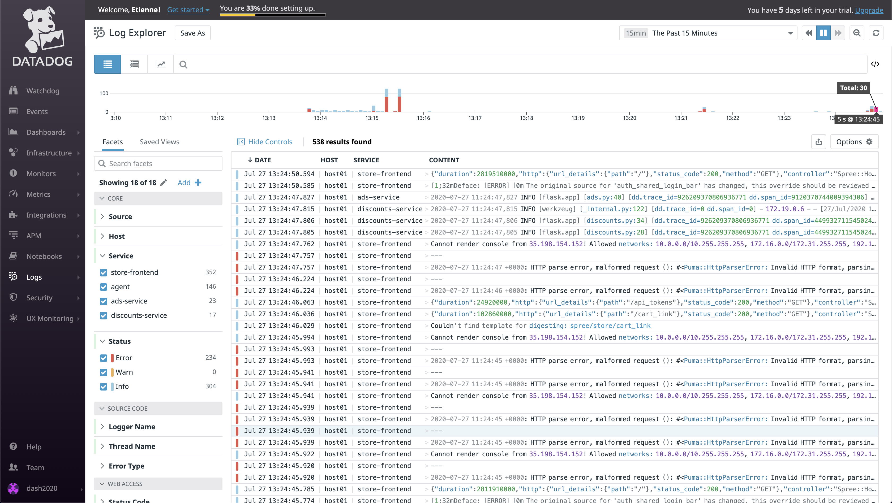

The different services are also available individually in APM.
It's useful to have a birds-eye view of all of the services or to focus on the current status of a single service.
And to troubleshoot problems, the traces can help to pinpoint the problem to a specific function in the code.
[Service list: https://app.datadoghq.com/apm/services](https://app.datadoghq.com/apm/services)
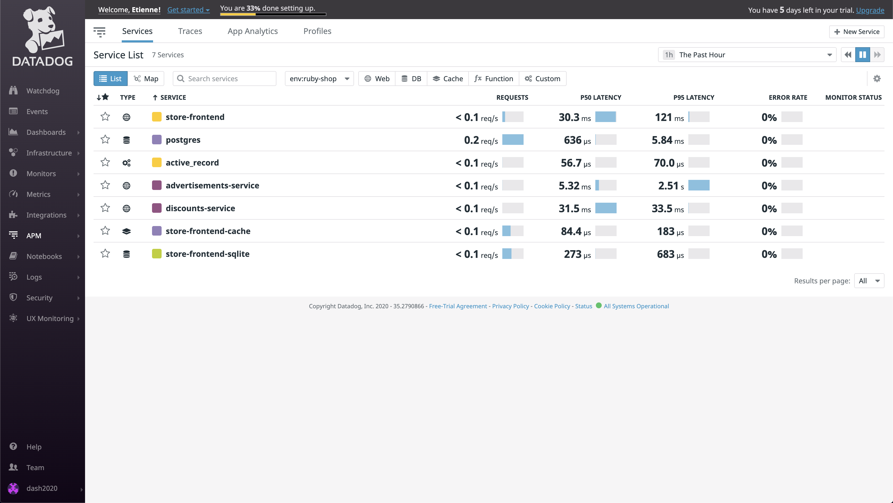

APM even builds a map of the different services to understand their interactions and their current activity.
[Service map: https://app.datadoghq.com/apm/map](https://app.datadoghq.com/apm/map)


<!--

## Setup RUM application

RUM is already integrated within the frontend of our application, and similarly to the datadog Agent, we just need to provide it with the right keys to start the monitoring.

Let's create a RUM application to monitor our frontend.
If we had a back office or a mobile application, that could be a different RUM application.

The RUM tool is under the UX Monitoring menu.
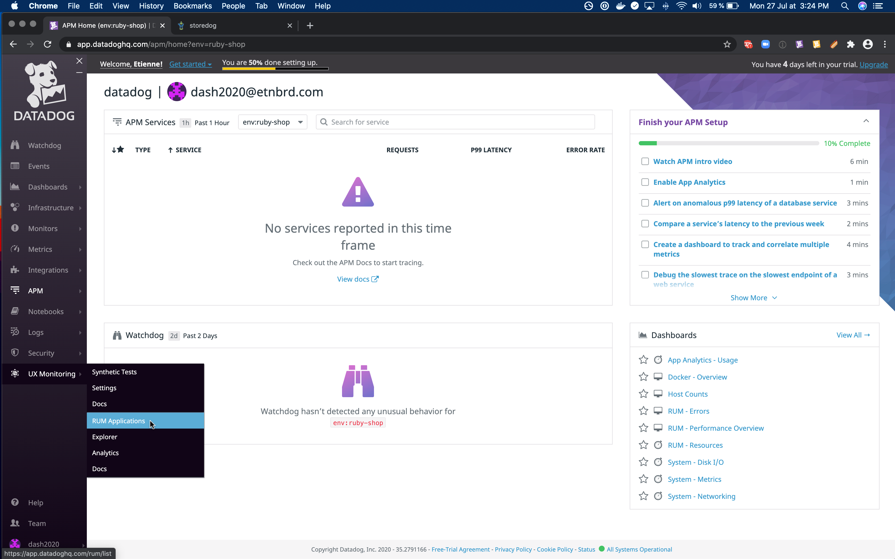

We should be prompted to create and name an application.
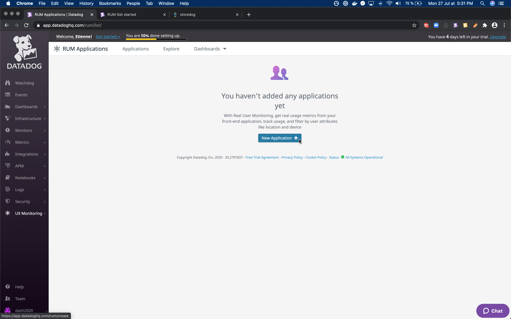
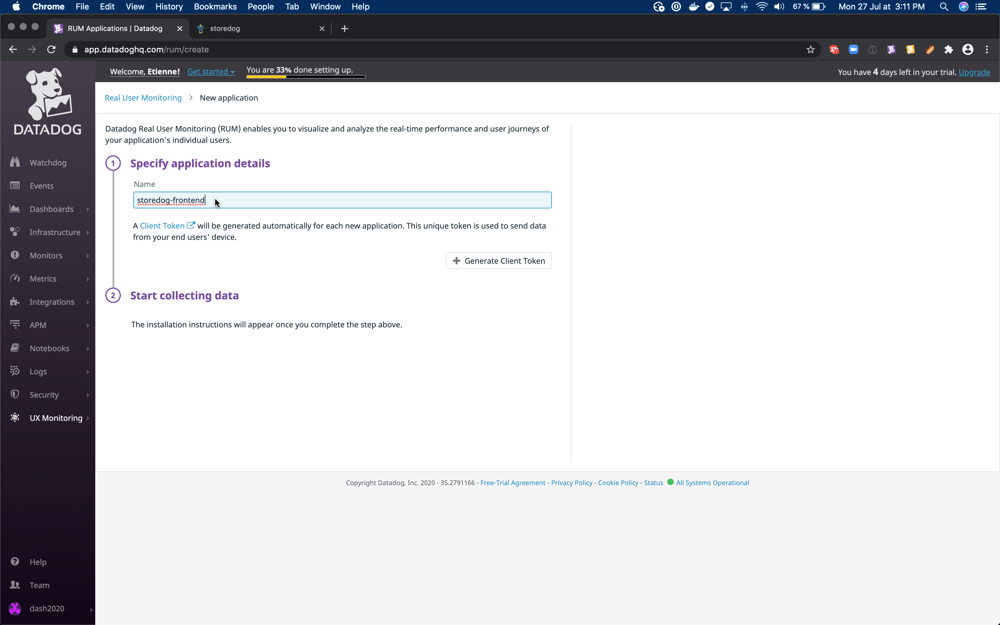

This application has a specific ID and client token we need to provide as environment variables.
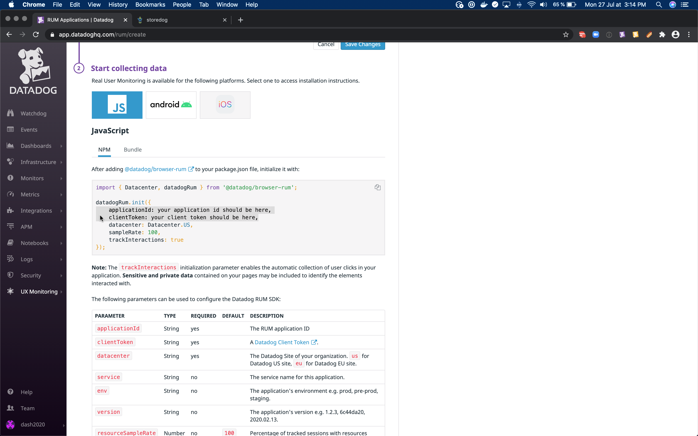

```
export DD_APPLICATION_ID=<your application id>
export DD_CLIENT_TOKEN=<your client token>
```

For the frontend to take into account these keys, restart the application.
`docker-compose -p prod restart`{{execute}}

## See RUM Traffic in Datadog

Once everything is running with the right tokens, we should be able to see some user data being reported to RUM.
> TODO can't make it work for now.

-->