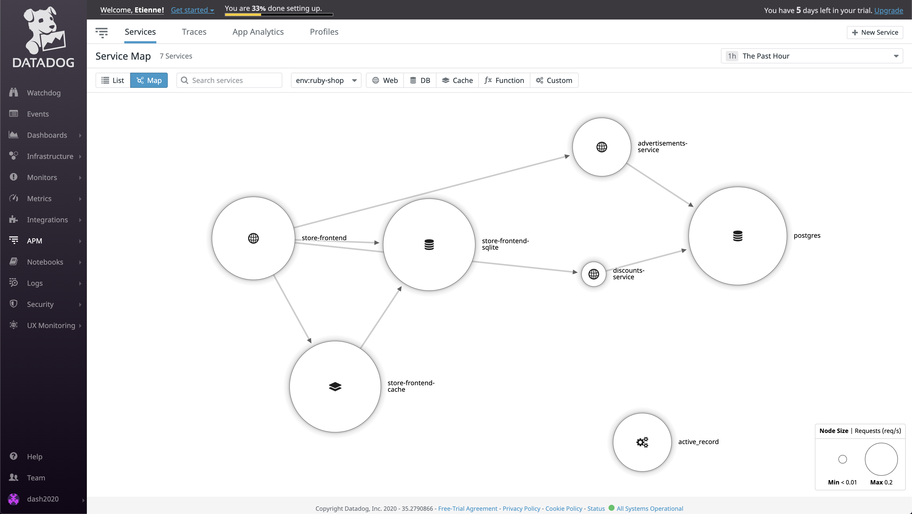

In this step, we will deploy the first environment and see it running.

# Application

## Build

The images were pre-built and pulled during the setup of this VM, so there is no need to build them as it takes quite some time.
Running `docker images`{{ execute }} we should be able to see all the images we need.

Though, there is one image we will rebuild later: the discount service.

```
docker build -t discounts-service discounts-service
```

## Deploy

Now let's deploy!
This workshop environment contains a fake CI/CD pipeline, so to deploy, we'll only need to run `git push deploy`{{execute}}.

Once everything is running, you should be able to visit the store by clicking on `storedog` in the tabs.


> For the curious among us, the `deploy` remote is just a bare local repository which allow to use the `pre-push` hook to launch a deployment script which simply run `docker-compose`.

<!-- 

# Datadog agent

## API and APP keys

In order to authenticate and send data, datadog clients will need the API and APP key from your datadog account.

We can find these keys in the Integration menu, within the APIs entry.


### API key

Once in the _APIs_ tab of the _Integration_ section, the API Key is in the first revealing section.
The API key is masked at first, but will reveal itself on a mouse hover.
Let's double-click to select and copy it to paste it later in the terminal.


The datadog agent will expect this API key to be available under the `DD_API_KEY` environment variable.
So we can simply export this variable to be available throughout our session.

```
export DD_API_KEY=<your api key>
```

### APP key

The Application keys are available in the second revealing section.
Contrary to the API key, the APP key is not yet created, and we need to create it ourselves.
This APP key will be required for Synthetics CI later on, so let's just call it `synthetics-ci`.


Once the APP key is created, it's available exactly like the API key.


We can export it as an env variable, exactly like the API key.

```
export DD_APP_KEY=<your app key>
```

For the agent to take into account these keys, we need to restart the application.

`git push deploy`{{execute}}
 --> 
## See Traffic in Datadog

The application is now running and instrumented, we should be able to see some traffic in datadog.

Some logs are sent to datadog each time a user is browsing the ecommerce app.
[Logs: https://app.datadoghq.com/logs](https://app.datadoghq.com/logs)


The different services are instrumented and available individually in APM.
[Service list: https://app.datadoghq.com/apm/services](https://app.datadoghq.com/apm/services)


Datadog even builds a map of the different services to understand their interactions.
[Service map: https://app.datadoghq.com/apm/map](https://app.datadoghq.com/apm/map)

