The datadog agent can monitor and send metrics from our backend, but it's not aimed at understanding the user experience.

With the increasing scale of our application, testing after each change to catch regressions will become longer and more tedious.
Imagine browsing all the critical paths of an application to make sure they are still behaving correctly.
At some point, it can't realistically be done manually.
Let's see how to automate these tests with end-to-end testing.

To do so, Datadog provides Synthetic tests.
They replay critical user interactions to make sure the application is behaving correctly.

In this workshop, we will create a test to monitor a critical part of our application and make sure it is always visible and available.

## Marketing Memo

The marketing team sent us a report showing that the discounts insert drives 83% of the site's revenue.

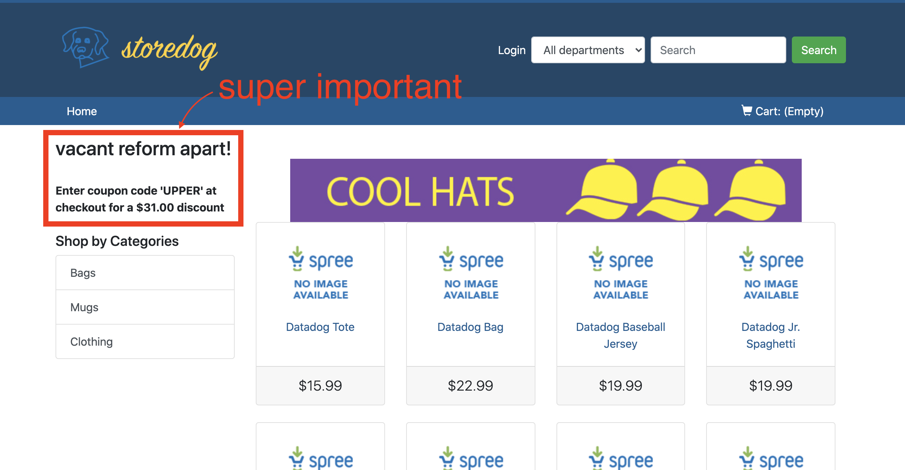

This revenue is definitely something we don't want to miss, so let's record a test to make sure it doesn't break!
The test we create allows us to proactively monitor that the discount codes are always appearing on the application.

The Synthetics tool is under the UX Monitoring menu.
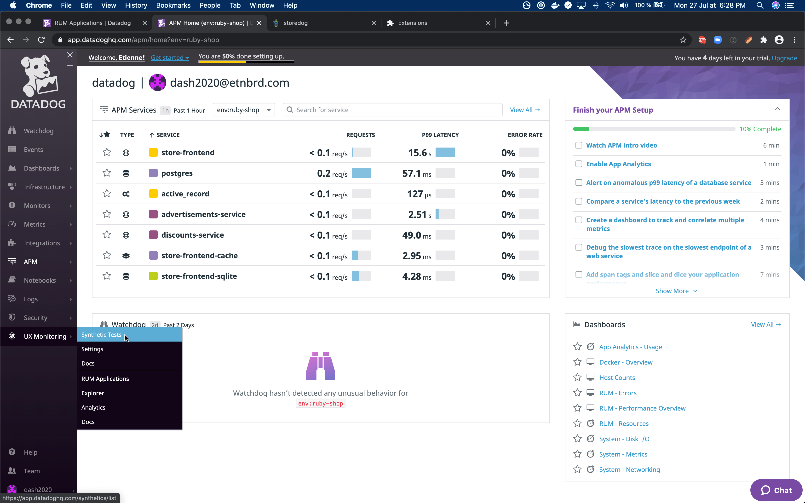

The first time, we might be greeted by a welcome screen to explain what UX Monitoring, RUM, and Synthetics are. Let's browse past that for now.
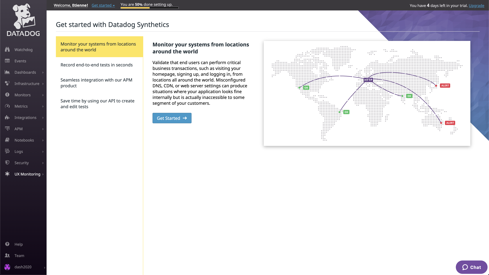

It'll ask us to create a first synthetics test.
If there isn't the greeting followed by the creation pop-up, there is a button on the top right corner to create a test.
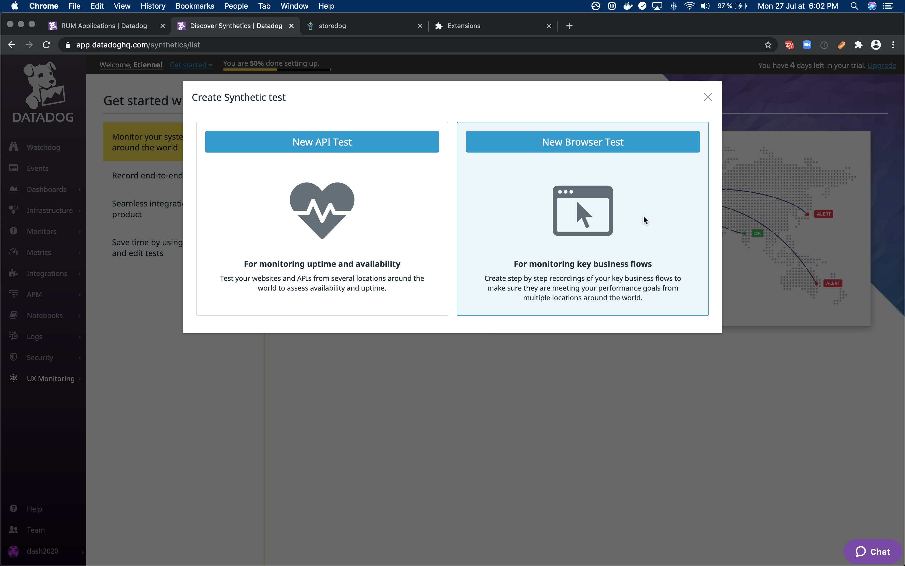

## Test details

The first page we land on while creating the test is the _test details_ page.

**URL**
We can fill in the URL used to start the test.
This is the URL of our `storedog` application.

**Name**
We then create a name for our test.
Here I put _"Disocunt insert is live and ok"_

**Tags**
We can add tags to group tests together to help browse in all of our tests, and so on.
I didn't put any tags as we will create only one test, but feel free to add some later on.

**Devices**
We can choose on which device our test will run, or on all devices.
With our development environment, we often test our application on a desktop, and it often takes an extra step to test on mobile as well.
So this is especially useful to make sure our application behaves correctly on mobile.

**Location**
We can run our synthetics test on a large number of locations to simulate our final users' location.
It's possible to select as many locations as we want, but one is enough for this workshop.

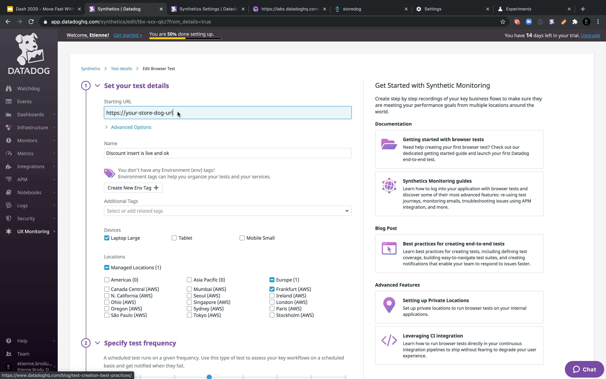

**Frequency**
We can choose at which frequency our test will run.
If we were to test something critical, we could push that to 5mn, or for lesser browsed pages, we could test only a few times a day, or a week.
Let's leave it at the default 1h for now.

**Alert**
Setting alerts might be one of the most critical parts of the test!
We can specify how relaxed the alerting is, to allow for a few failures before warning us.
This is especially useful to filter transient errors that resolve themselves in a few minutes or so.

For our workshop, set alerts to be as soon as possible, though, let's specify the alert to email us only at test failure.

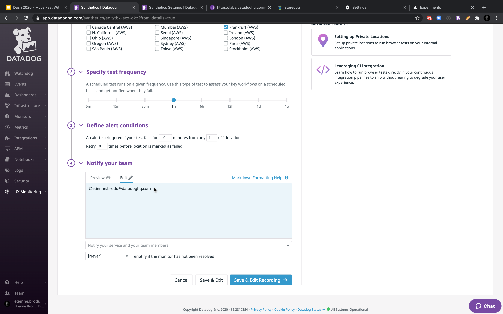

Once you fill out the test details, click on the _Save & Edit Recording_ button to start recording the actions we want to monitor.

## Installing the extension

While recording a synthetics test, we catch all interactions with the page in the recorded tab. To do so correctly, we need to install an extension in the browser.

[Datadog Synthetics Chrome Extension](https://chrome.google.com/webstore/detail/datadog-test-recorder/kkbncfpddhdmkfmalecgnphegacgejoa)

This extension is only available for Chrome for now.
> Firefox users: you can continue your workshop with Firefox and switch to Chrome only for the recording part. To do so, paste the URL in Chrome, install the extension, and then you should be good to go.
Firefox users, let us know if you are interested in having the recorder ported to Firefox to help us prioritize it.

Once you install the extension, it's time to record your first test!

## Discount insert is present

The first test we are going to record is fairly simple: make sure the element containing the discount code is present on the page.

First, let's create an assertion by clicking on the _Assertion_ button.
It might come off as obvious, but it's always good to remember: tests should always contain at least one assertion, and finish on an assertion.
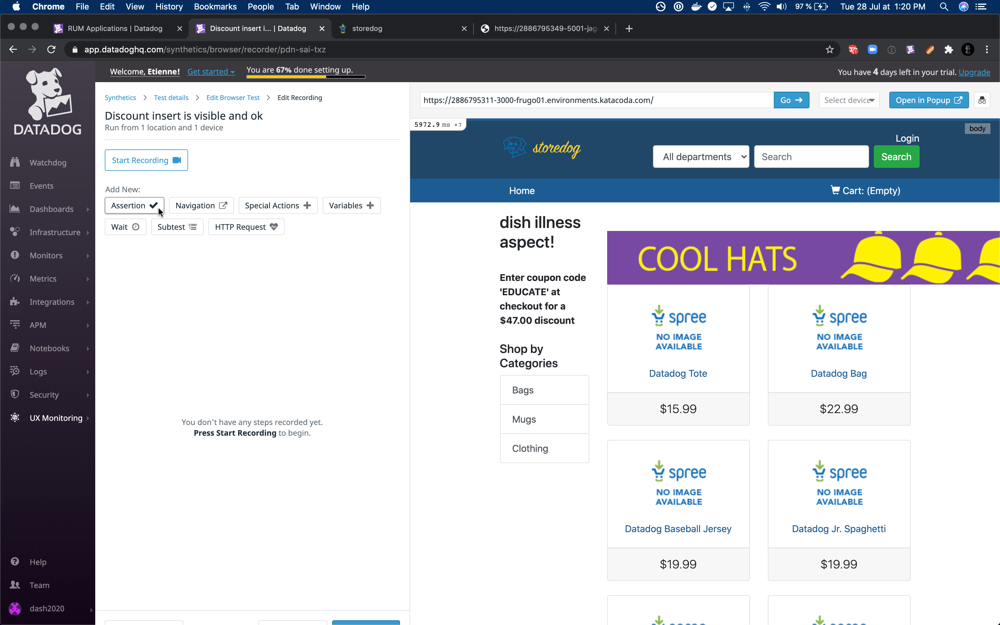

Assert the discount insert is visible by making sure the element is present on the page.
Click on _Test that an element is present_.
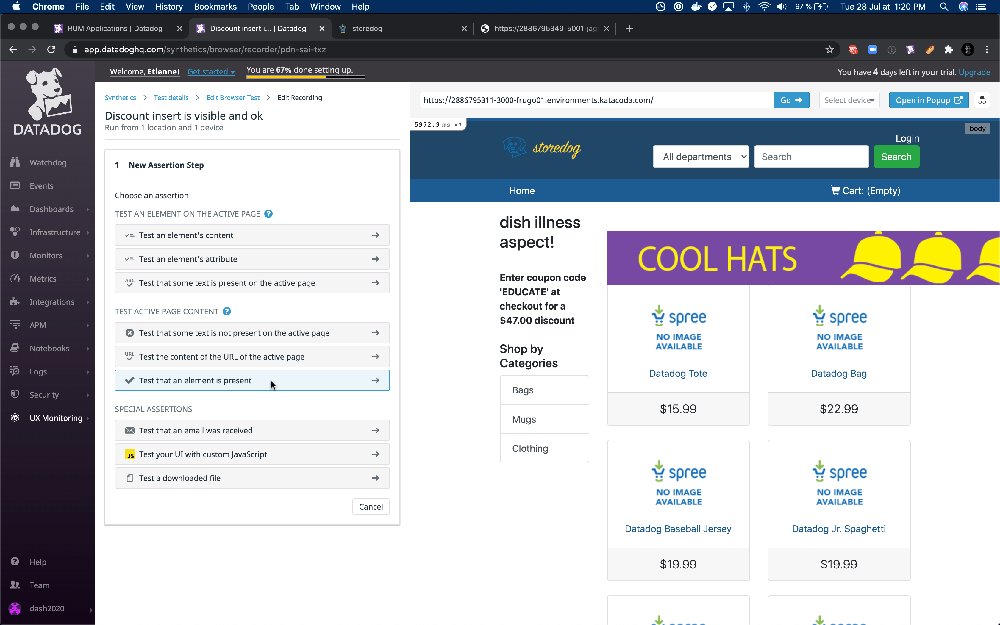

Then, select which element should be present on the page.
Click on the element containing the discount code.
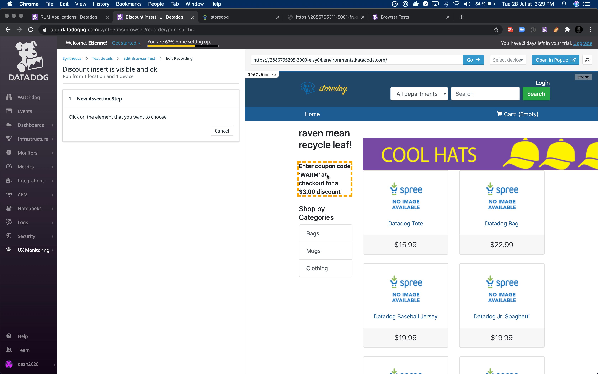

And done! We just created our first assertion that the discount code is visible.
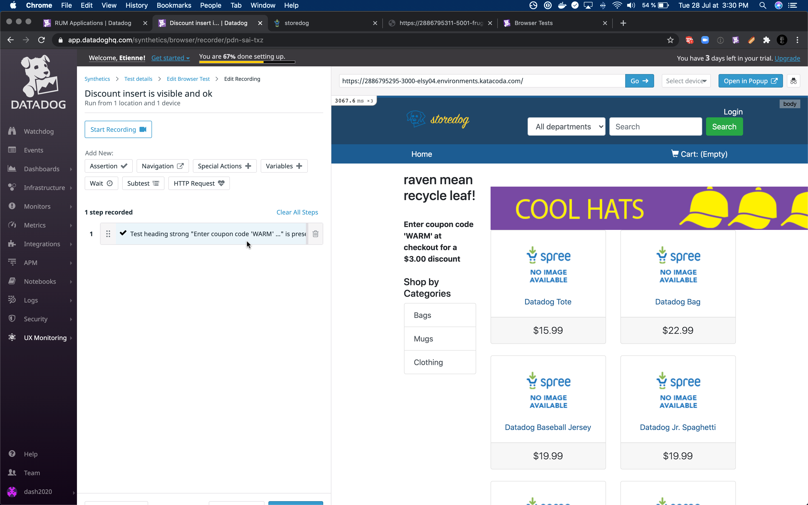

Let's see that this test is working.
We can save the test by clicking on the button "Save & launch the test" at the bottom of the page.
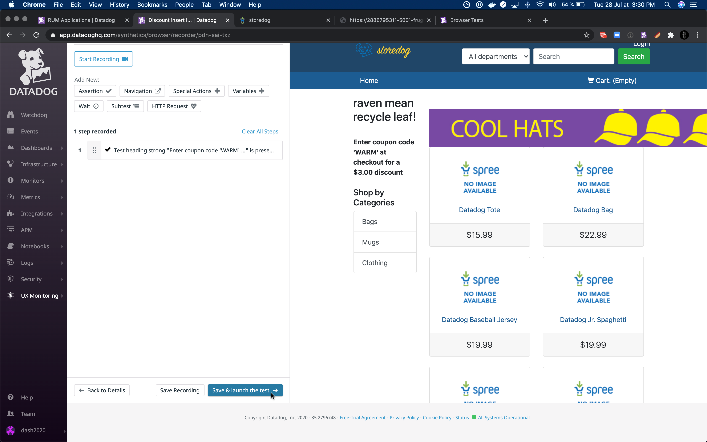

And after a couple of minutes, we should see our first results coming in.
The test is live and seems to be working!
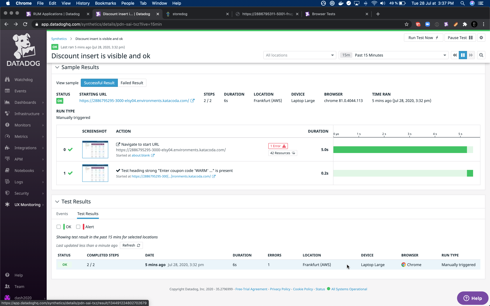

You might have noticed that the element's content is always changing, yet we still manage to find the element on the page.
Our localization algorithms use various strategies to locate an element. Some of them are based on the content of the element, but not all.
So if the text of the element is changing, the other localization strategies can take over. And if the element is moving in the DOM, or if its `id` or `class` are changing, the content-based strategies can take lead to always find the right element.
And if the element is detected to be modified, all the strategies are updated automatically so that all the strategies are working the next time the test is run.

## Discount insert is displayed as expected

Let's dive in a bit deeper and record a test to make sure the discount code displayed as expected.

Let's create a new step in our existing test.
Click on the cog, in the top right corner, and then on _Edit recording_
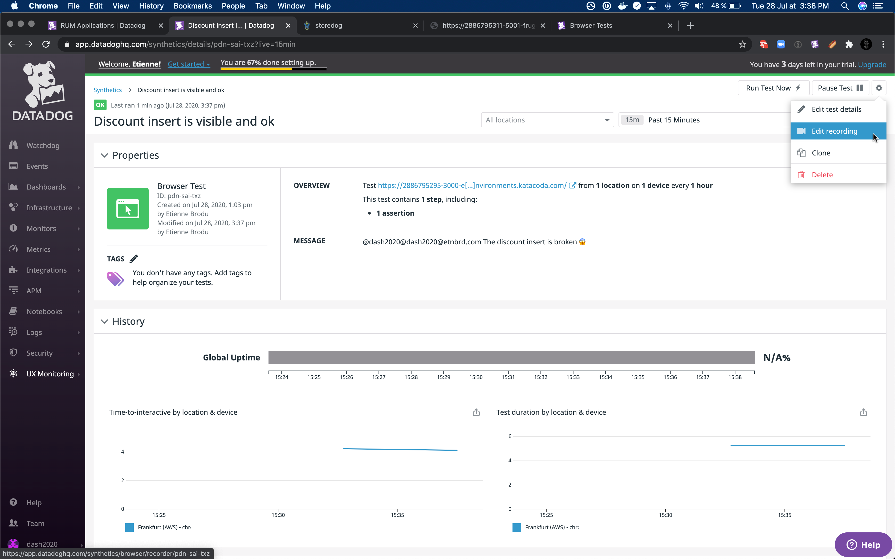

We are now back in the steps list, and ready to record our new step.
Click again on the assertion button, but now choose _Test an element's content_.
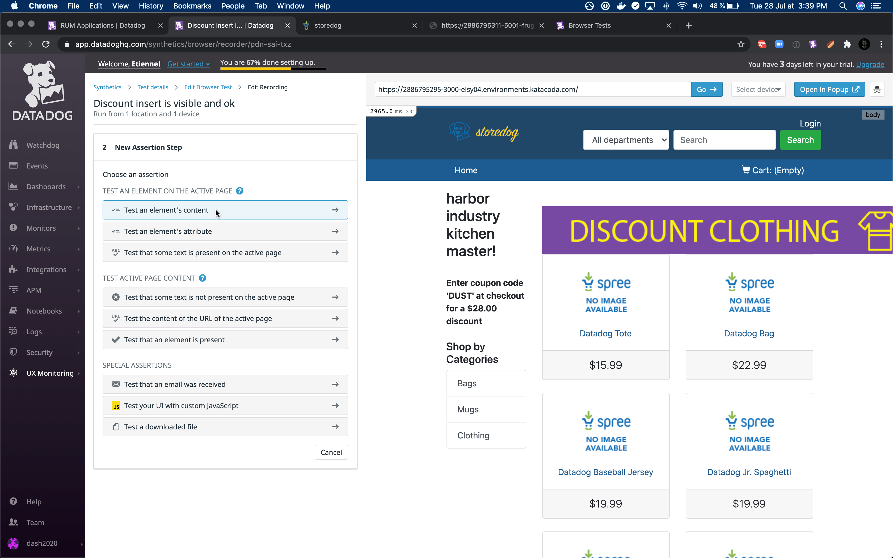

We choose the same element containing the discount code again, and we would like to test that its content is what we expect, even though it's changing every time.
We can use the regex assertion.
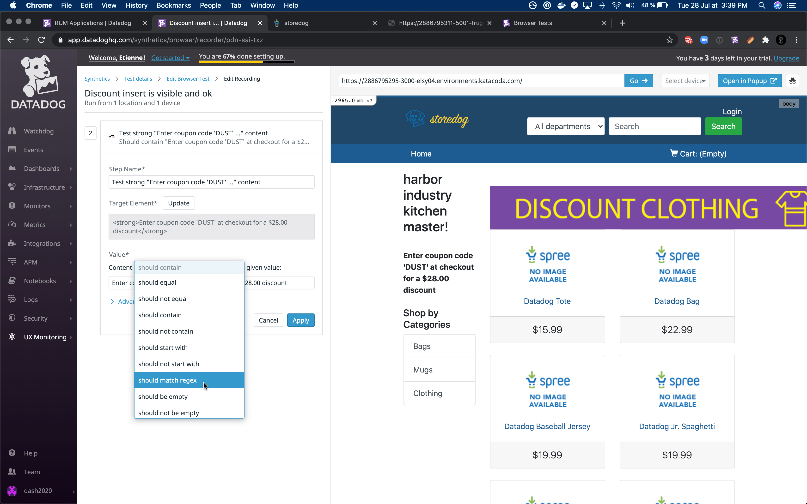

We want the discount code to be between 3 to 8 letters.
`^Enter coupon code '[A-Z]{3,8}' at checkout`{{copy}}
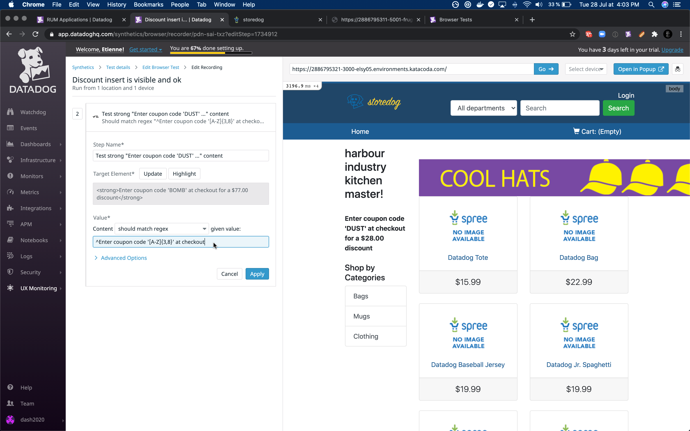
Let's save and check that our test is still green.