## Discount code is valid

The discount code matched by the regex could be anything. It doesn't mean it's valid, though.

Let's use some more advanced techniques to make sure the code is valid.

We will create two more steps:
1. Extract the discount code into a local variable using Javascript.
2. Make an HTTP request to the discount service to make sure the code from the variable is valid.

### Extract the discount code

Let's edit the recording again by clicking on the cog, then _Edit recording_.
Then, we can add a new variable extraction step by clicking on the _Variables_ button.
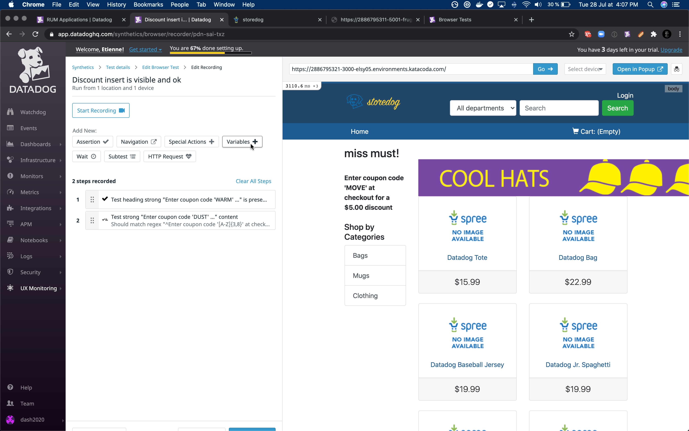

We choose to create our variable from Javascript in the dropdown, and name it `CODE`.
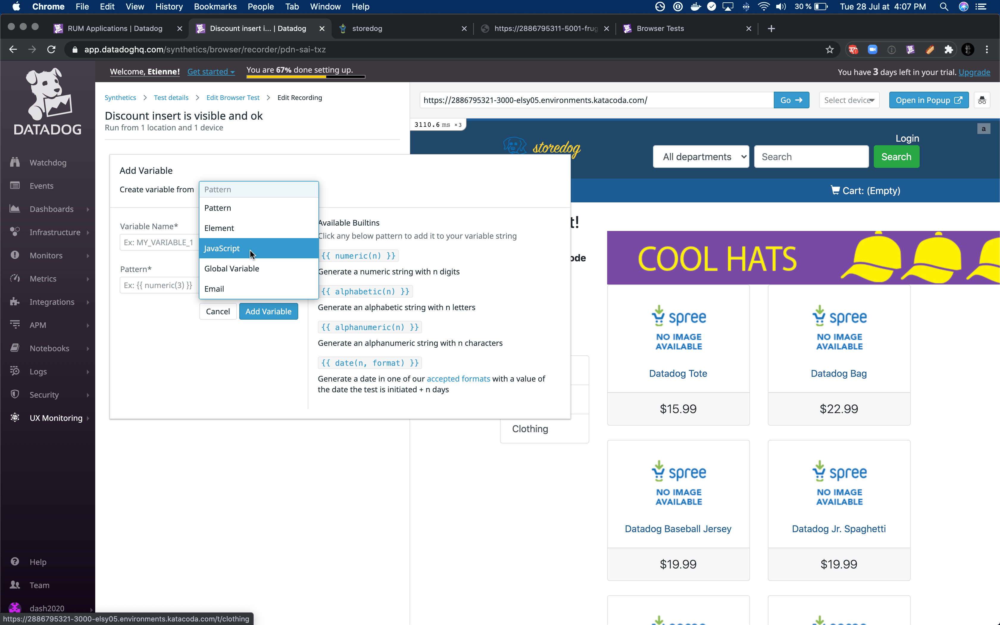

A few explanations of the different variables:
- Pattern: create random values that are helpful to fill fields and forms randomly. For example, a timestamp. It's not necessarily random, though. It can also create a variable containing a predefined, static text to be reused in the test.
- Element: create a value from the content of the element. We won't use that as we need only a part of the content.
- Global variable: import a global variable into this test. A global variable is available to all tests and can contain credentials, URLs, and so on, that needs to be available globally.
- Email: create an email address that can receive mail. It's very useful for confirmation links, notifications, and so on.

We want to extract the value from a specific element — the discount insert — so let's select this element, like in the previous steps.
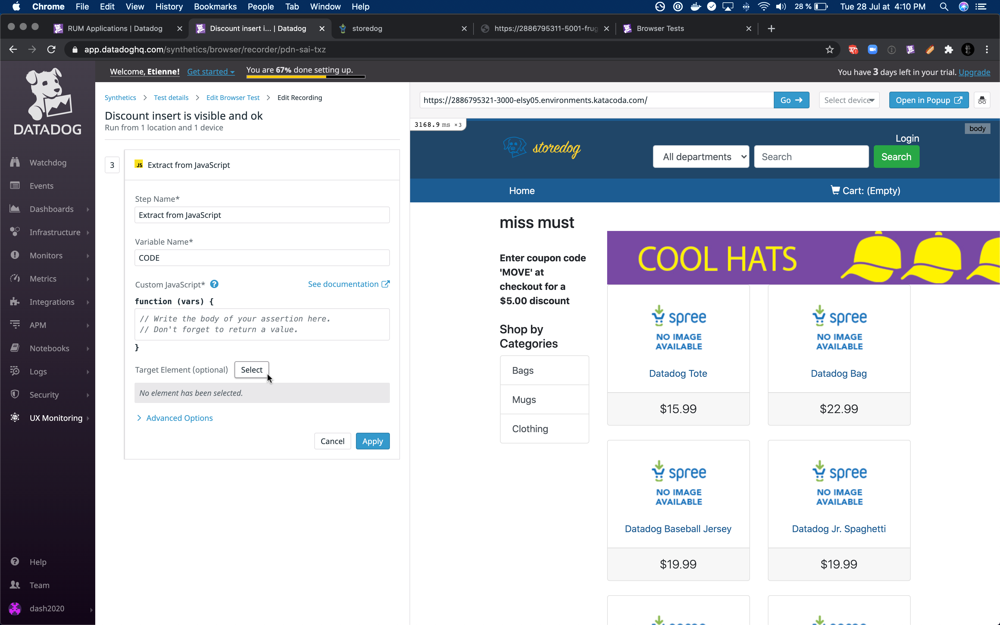

And to finish, we will write some code to extract the code from the element content.
We can use the same regex from the previous step, but with a capturing group using parenthesis `(...)`. The rest of the code is just getting the value of the captured group and returning it to fill the variable.
<pre class="hljs file javascript" data-target="clipboard">
// regex capturing the discount code
const regex = /^Enter coupon code '([A-Z]{3,8})' at checkout/
const [full, code] = element.innerText.match(regex)
return code
</pre>
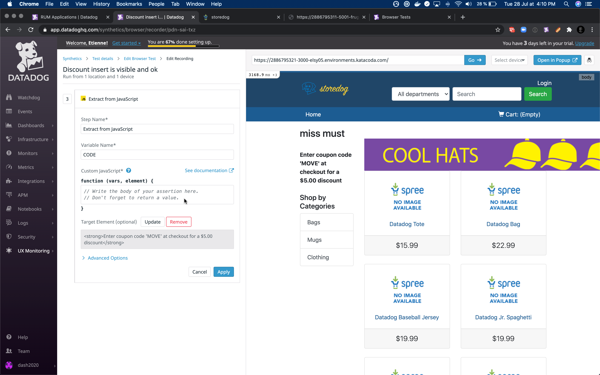

And we should be all good, and have the code extracted successfully!
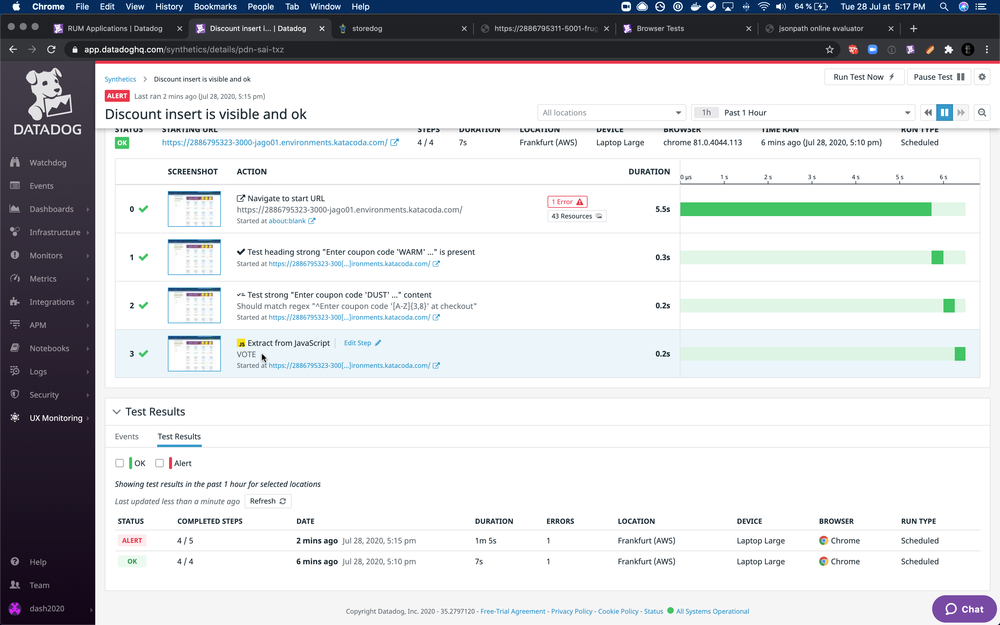

### Validate the discount code

Now that we have the discount code extracted into a variable, let's make sure it's a valid code according to the discount service.
For this, we will use an HTTP request step inside our browser test, query the discount service directly, and make an assertion on the presence of the extracted code in the returned valid code.

Let's create an HTTP request step by clicking on the _HTTP Request_ button.
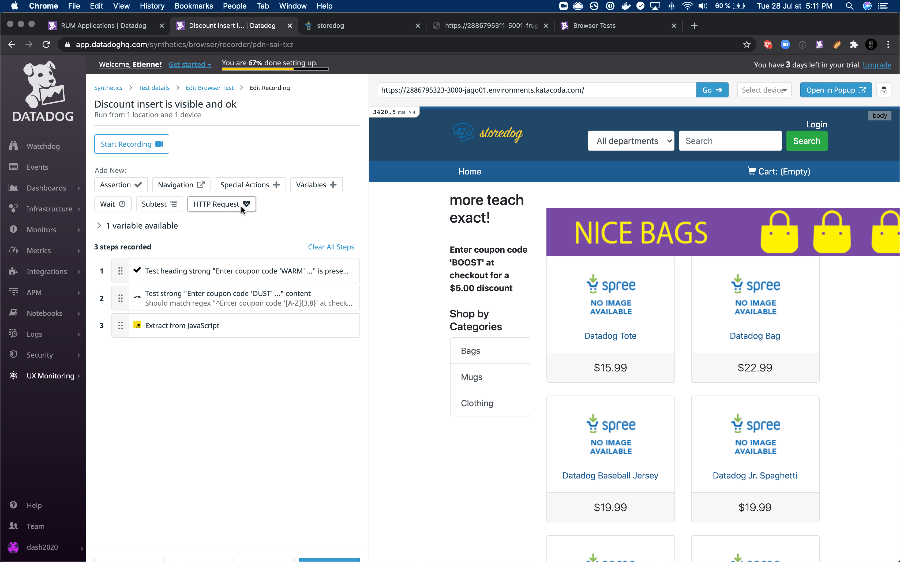

It asks us an URL for the service to query.
This is the URL of our `discounts-servie` that is available by clicking on `discounts` in the tabs.
Alternatively, it is the same as storedog, **except we replace 3000 with 5001 (the url-coded port), and it ends with `/discount`**
The `/discount` endpoints returns all the available discount codes.
And we will check that the extracted code is available within the returned codes.
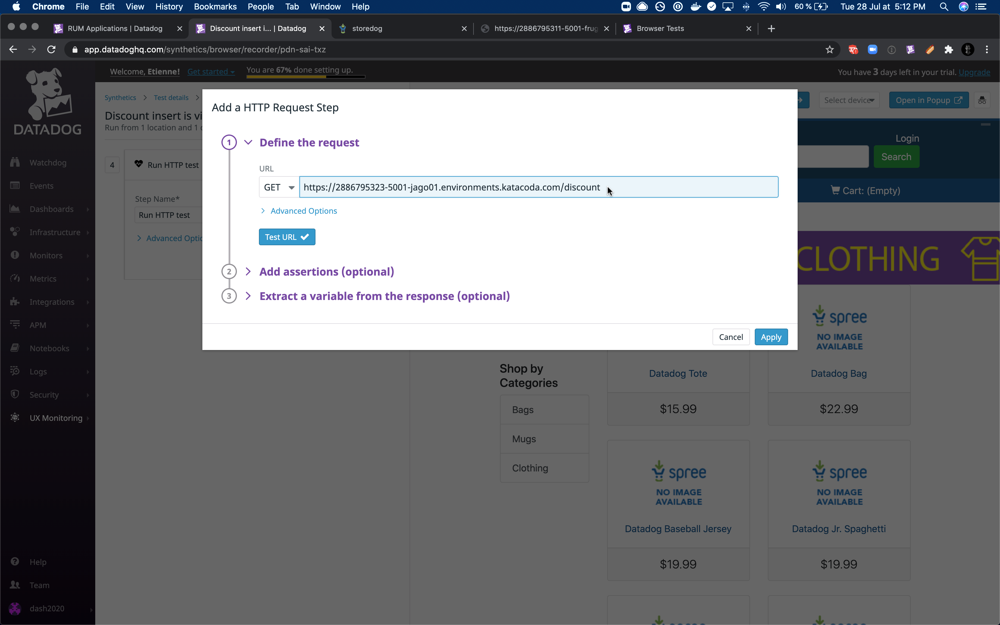

We can click on the _Test the url_ button to make sure the service is live and responding.
And we should see the result and status of the request.
Some assertions are pre-filled with default, sane values.
We can add our own by clicking the _New assertion_ button. 
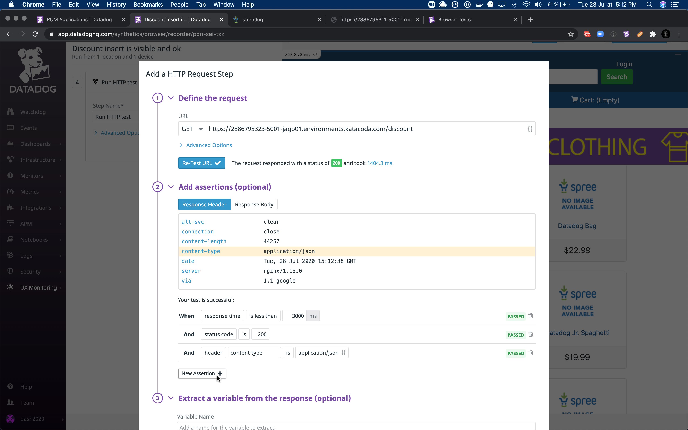

Our assertion holds on the body of the request.
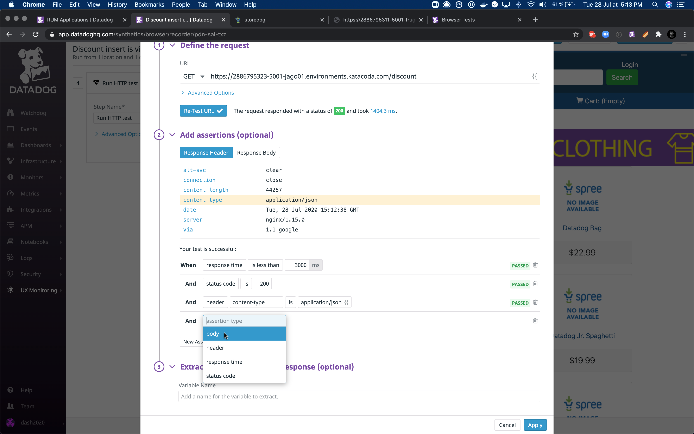

And this body should contain the value of the extracted code, so we use the previously extracted variable `CODE` as the value to check for this assertion.
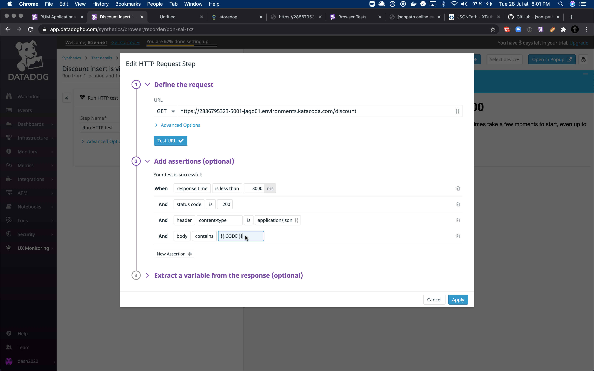

After validation, we can see this fourth step in our test.
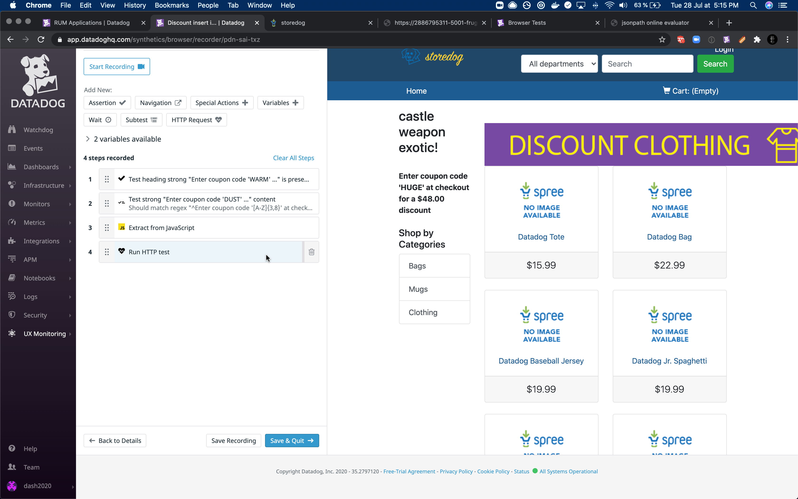

We can _Save & Quit_ to exit back on the details page of the test.
Then, we can click the _Run Test Now_ button, in the top right corner, to trigger the test to run immediatly, instead of waiting for the next scheduling.

And after a couple of minutes, our test should be executed and still passing.
By clicking on the HTTP Request step, we can see all the details of the http request and our custom assertion.
In the following screenshot, we can see that the extracted value at step 3 is `FLASH`, and our assertion in step 4 is that the body contains `FLASH`. It's passing, so the code must be valid.
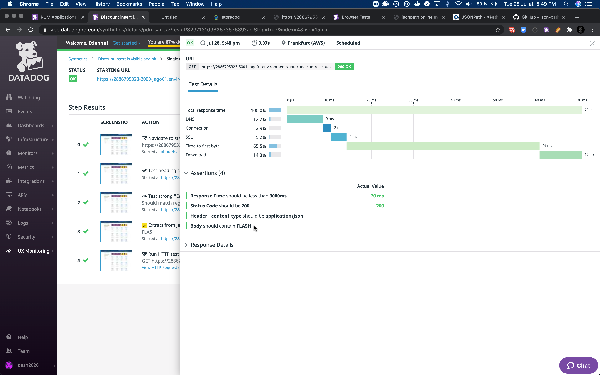