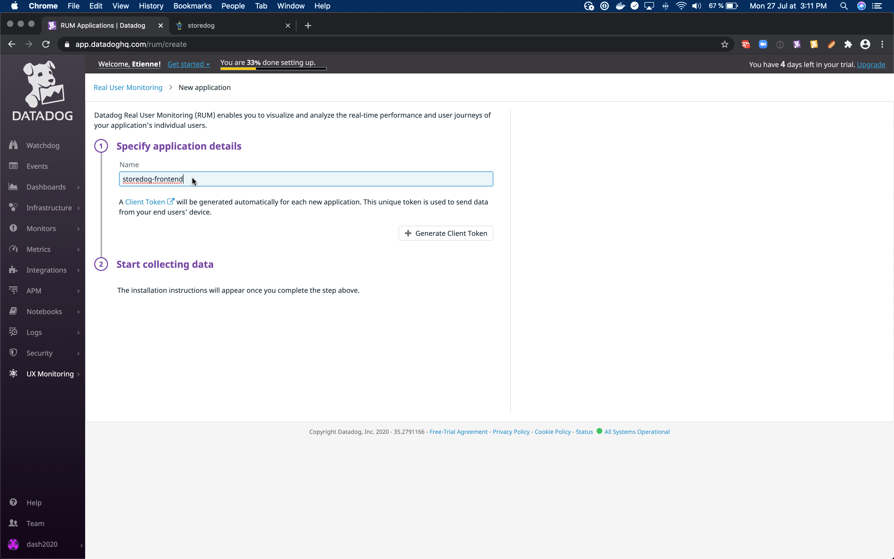

# UX Monitoring

The datadog agent can monitor and send metrics from our backend, but it's not aimed at understanding the user experience.

With the increasing scale of software systems, testing after each change to catch regressions will become longer and more tedious.
Imagine browsing all the critical paths of an application to make sure they are still behaving correctly.
At some point, it won't realistically be done manually.
Let's see how to automate these tests with end-to-end testing and monitoring.

To do so, Datadog provides two tools: Real User Monitoring (RUM) and Synthetics.
The former captures all interactions from users, and help to catch unexpeced issues.
The latter replays critical user interactions to make sure the application is behaving correctly.

In this workshop, we will focus on the latter to monitor critical paths in our application, and make sure they are always available.

<!--

## Setup RUM application

RUM is already integrated within the frontend of our application, and similarly to the datadog agent, we just need to provide it with the right keys to start the monitoring.

Let's create a RUM application to monitor our frontend.
If we had a backoffice, or a mobile application, that could be a different RUM application.

The RUM tool is under the UX Monitoring menu.


We should be prompted to create and name an application.



This application has a specific id and client token we need to provide as environment variables.


```
export DD_APPLICATION_ID=<your application id>
export DD_CLIENT_TOKEN=<your client token>
```

For the frontend to take into account these keys, we need to restart the application.
`docker-compose -p prod restart`{{execute}}

## See RUM Traffic in Datadog

Once everything is running with the right tokens, we should be able to see some user data being reported to RUM.
> TODO can't make it work for now.

-->

## Setup Synthetics

<!--
While we're at it, let's setup everything we will need for later.

As stated above, Synthetics is the counter-part to RUM. When RUM collects directly data, while Synthetics helps us make sure specific user path are always available.
-->

While recording a synthetics test, we catch all interactions with the page in the recorded tab. To do so correctly, we need to install an extension in the browser.

[Datadog Synthetics Chrome Extension](https://chrome.google.com/webstore/detail/datadog-test-recorder/kkbncfpddhdmkfmalecgnphegacgejoa)

This extension is only available for Chrome for now.
>Firefox users: let us know if you are interested in having it ported, in order to help with its prioritization.

Once the extension is installed, we can record our first test.
