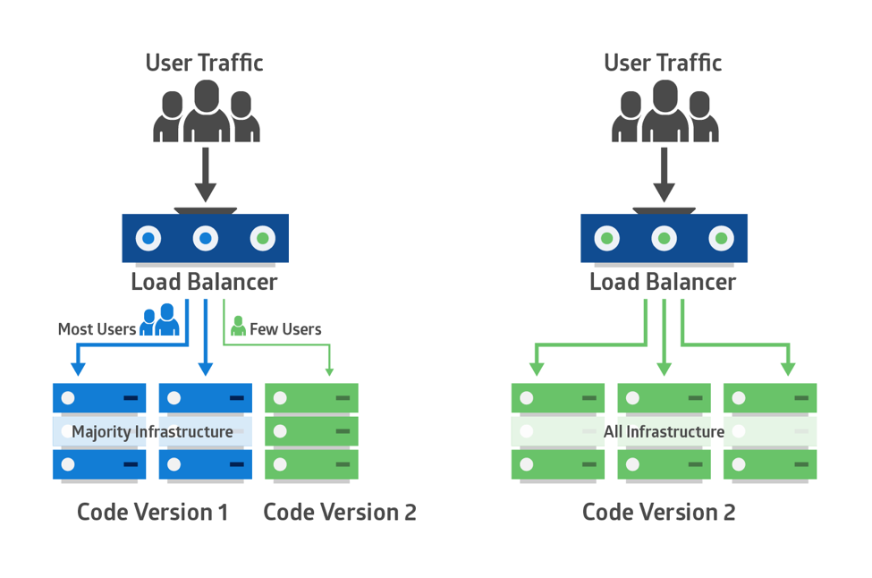
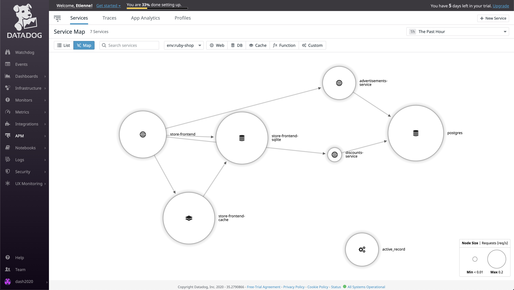
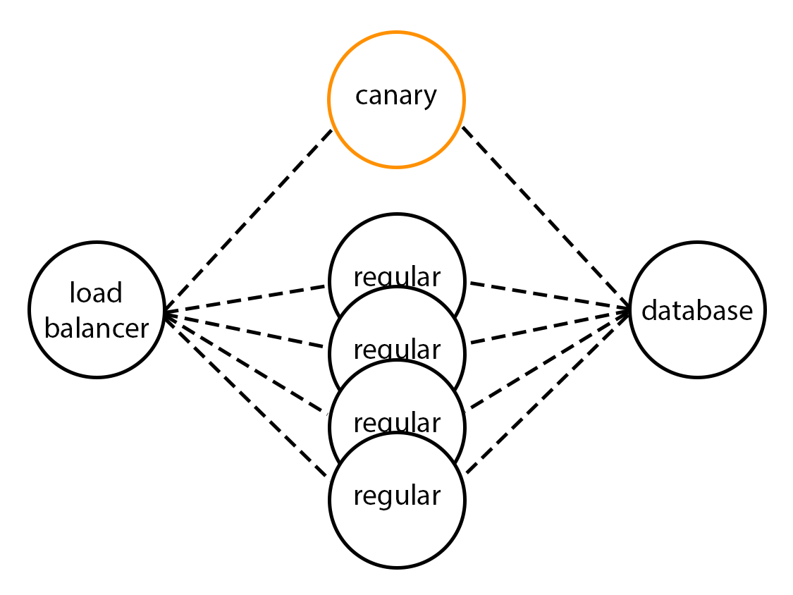

So we have a production environment running, and we broke it once already.
It's time to limit the impact any regression could have on our production environment.

# Blast radius

At scale, even the smallest chance of failing can take on huge proportion and be almost certain to happen.
If our application has even 0.1% chance of crashing, and we have 1000 concurrent instances, then at least one is failing at any time.
At scale, "this will never happen anyway" is next tuesday morning.

We can't act on the probability of a failure as it's always unexpected, and undesirable.
However, we can act on the scale of impact of the error on users.

# Canary deployment

The canary deployment strategy is deploying changes at a reduced scale to contain the overall risk of failure to a subset of users.
We deploy the change to only a subset of our infrastructure, or for a subset of users, and see that everything goes as planned before deploying globally.

The goal of a canary deployment is two-folds:
- limit the blast radius of any uncertain change, and
- allow to very quickly revert if things goes sideways.

In a real environment, we might want to dedicate a part of our infrastructure, and configure it to fit the landscape of our existing applications.
For this workshop, we will keep things simple, and just change the `docker-compose.yml` file containing our infrastructure description with the following patch.

Looking at the service map, we see there is a postgres database at the far left, which is common for the discount (and the advertisement) service.
And the `store-frontend` service is hitting directly the `discounts-service`.

We could setup new instances for both of these services, `discounts-service` and `store-frontend` to be our canary.

## Load balancer

To keep a single point of contact, we would need a load balancer to distribute users to the regular or canary instances.
The load-balancer could distribute traffic randomly, or depending on a set of user id.
This way, only a subset of users would be impacted by a potential failure introduced by the Canary.

In this workshop, to keep things simple, we will manually choose the flavor we want to hit by changing the url.

## Database

The database needs to stay unique to make sure all instances have the same data.
Otherwise, users hitting the canary would loose their user profile, for example.
Though, it can be replicated, sharded, distributed, to allow for a high load capacity.

In case we want to push a change on the database as well, it's common to make the code handle both the old and the new database format, and only then change the format in the database.
With scale, it might not be possible to update all the entries in the database, nor to remove them in a timely fashion.

# Storedog:canary

Let's create a canary for our discount service and store-frontend.

`git apply 0001-construction-canary.patch`{{ execute }}

`git diff`{{ execute }}

The diff is quite big, but mostly, it adds two new services to act as our canaries:
- `discount-canary`
- `frontend-canary`

We can commit and push to deploy these new services.

`git commit -a -m ":building_construction: add canary"`{{ execute }}

`git push deploy`{{ execute }}

Once it's ready, we should have a clone of our storedog ready to receive any changes we might want to test.

# Testing the canary

Let's break things once again!
But only on the canary this time.

## Canary branch

Let's change branch to apply the modification only to our canary.

`git checkout -b canary`{{ execute }}

## Break things

`git apply 0001-fire-break-stuffs.patch`{{ execute }}

`git commit -a -m ":globe_with_meridians: improve naming with coupon instead of code"`{{ execute }}

`git push deploy`{{ execute }}

Once the change is deployed, we can see it live on the canary only, while our production is still pristine.

## Revert!

`git revert HEAD --no-edit`{{ execute }}

`git push deploy`{{ execute }}

<!--

# Blue/green deployment

A simpler alternative to the canary deployment strategy is the Blue/green deployment strategy.
It consists of deploying both version concurrently, and switching the traffic from one version to the next.
It doesn't reduce the blast radius of a potential failure, but if anything goes sideways, reverting is still very fast.

Let's deploy a new environment for the canary!

> TODO I am not sure how best to "simulate" or provide two concurrently running environment.
I was thinking of modifying the docker-compose to have several replicas all pointing to the same database, and reloading only one of the replica with the new image.
We will have the attendee imagine a load balancer, pointing to these 2 replicas, one of which is the canary.
As we will operate on the discount services, it would mean spinning a canary front-end as well, though.

> TODO It might make more sense to move this step to after we have synthetics test running, as a part of deploying a change, maybe? But it might get confusin in the story: having the canary deployment in the middle of the end-to-end testing.

---

Fun fact (which is not so fun) the canary term comes from the canaries that miners were using in Coal mines to alert of a potential inodor but toxic gas leaks. The canary would die first from ashpyxie, alerting the miners of the gas leak.

# Digging In

Going further than canary deployments, there are some more strategies we can adopt - they all adopt the same pattern as canary development.

- [Feature flags](https://featureflags.io) are a way to activate and show some features of an application only for a subset of users.
They are lightweight and fast to implement in your own code base.
This comes with some limitations, however, as they are only available from within the application.
It cannot protect from failures in the infrastructure, or from bug crashing the application, even for users without the feature flags activated.

- Blue-green deployments are like canary deployments, but switching the whole traffic from one version to the other. A canary deployment is usually preferable as are less risky.

- Rolling deployments are like canary deployments, but are performed by switching traffic progressively from one version to the next.
This practice is tangential to the idea of keeping several versions of the same software system available.

-->

