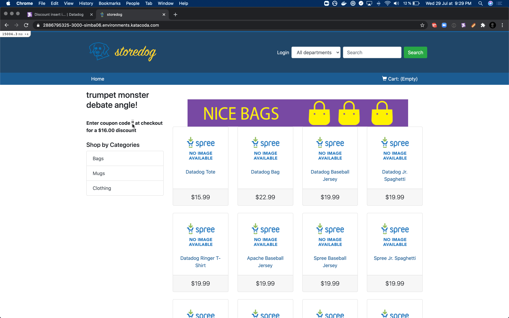

At some point, the team responsible for the discounts service decided to refactor some naming in their service.
And at this step, we will assume the role of someone from their team and deploy this refactor.

They tested heavily internally to make sure everything was consistent and working.
However, a slight change in the interface with storedog is going to introduce a bug in the UI, preventing the discount code from being displayed.

# Break things!

For the purpose of this workshop, we will keep things extremely simple, and introduce the smallest change to break the discount service: the discount team decided to rename `code` into `coupon`.

The change is ready as a patch we can immediatly apply without editing any files.

`git apply 0001-fire-break-stuffs.patch`{{ execute }}

We can see the changes introduced.

`git diff`{{ execute }}

And then commit and deploy these changes.

`git commit -a -m ":globe_with_meridians: improve naming with coupon instead of code"`{{ execute }}

`git push deploy`{{ execute }}

Once the change is deployed, we can see it is live, and indeed, diverging from what is expected.

The test should soon fail, and alert us.
We can trigger it manually to get the result faster.

# Revert!

The site is publicly broken - there's no time to waste, let's revert the change we just made and redeploy!

`git revert HEAD --no-edit`{{ execute }}

`git push deploy`{{ execute }}

# Summary

What did we learn here?
If we had used the canary deployment strategy, we could have limited the impact of this breaking change on a subset of users.

Thanks to the Synthetics test, we managed to detect this breaking change and revert it in a timely fashion.
Without these tests, it might have taken a frustrated user to send us an email about this regression for us to find out about it.
Definitely not the user experience we want to provide.
