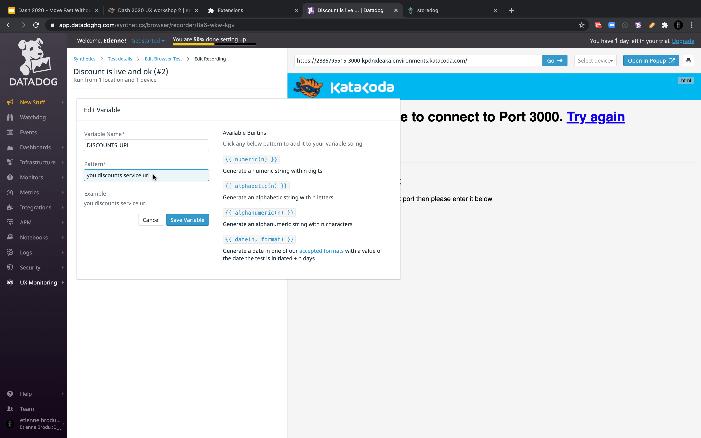
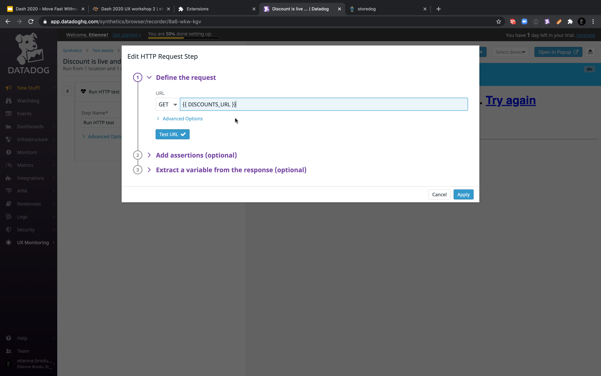
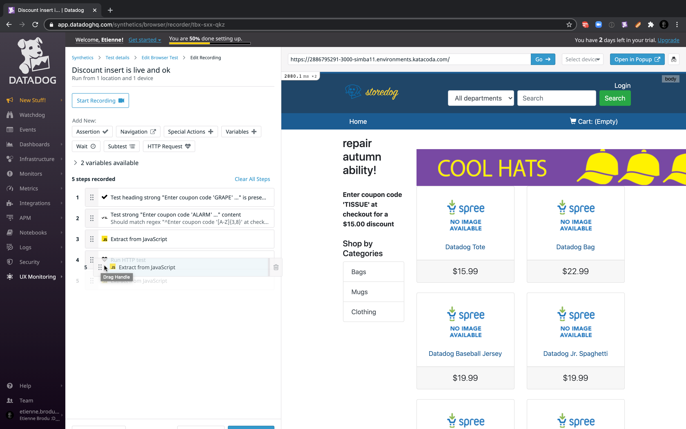
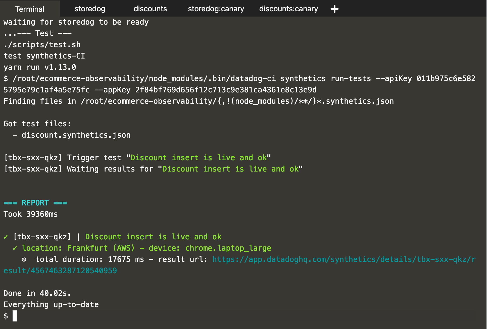
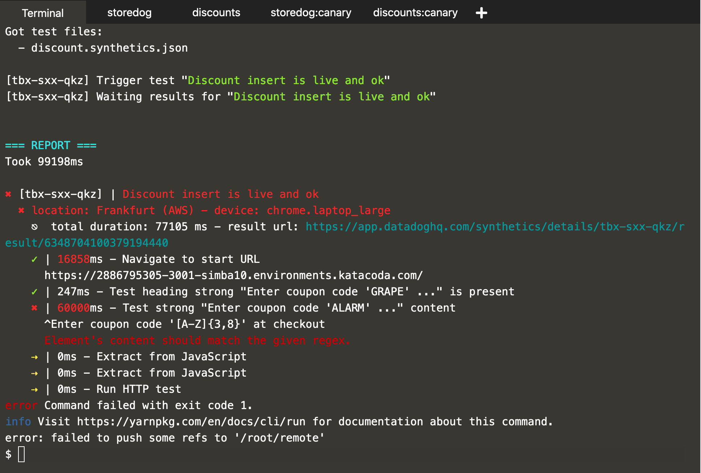

Our synthetics test runs every hours, and at most every 5 minutes, which means a breaking change would be live during these 5 minutes before being caught by a test.

We setup a canary to reduce the impact of any regression, but to push things further, we could catch regressions even before they are live.
To do so, we would like to trigger the synthetics test during our CI/CD pipeline.
The Synthetics CI feature does just that, it allows to trigger Synthetics test during our CI/CD pipeline.

Then we would like to have our CI/CD pipeline setup the canary, and before even redirecting users to it, have the synthetics test make sure it's behaving as expected.
Our load balancer is imaginary anyway, so that's just a matter of triggering the Synthetics tests once the canary is deployed.

# Synthetics-ci

## Setup

For the Synthetics CI to know which test to trigger, it reads all the `*.synthetics.json` file.
Here is an example of such a file containing two tests, `abc-def-ghi` and `jkl-mno-pqr`:

```json
{
  "tests": [
    {
      "id": "abc-def-ghi",
    }
    {
      "id": "jkl-mno-pqr",
    }
  ]
}
```

The id of your synthetics test has the form `abc-def-ghi`.
You can find it either as the last part in the url while browsing the test, or in the summary page of the test, in the properties section.

Let's create this file and fill in these info in the editor.

`touch /root/ecommerce-observability/discount.synthetics.json`{{ execute }}

Let's open this newly created file.

<pre class="hljs file json" data-filename="/root/ecommerce-observability/discount.synthetics.json" data-target="replace">
{
  "tests": [
    {
      "id": "the id of your synthetics test",
      "config": {
        "startUrl": "your canary storedog url"
      }
    }
  ]
}
</pre>

The `config.startUrl` will indicate `datadog-ci` to override the start url with the one given here.
This is especially useful as we can use the exact same synthetics test for our production and canary.

## Update test

In our current test, we send an HTTP test request to an URL we hardcoded to be the one from the store.
With our new Canary setup, this hardcoded URL will always points to the production storedog, not the canary one.

Fortunately, HTTP tests accept variables in their url.
Let's create a variable containing the expected url for the canary discount service.

We create a new `Variables` step again, select `Javascript` in the dropdown.
We can name this new variable `DISCOUNT_HREF`.
And this time, we paste the following code:

<pre class="hljs file javascript" data-target="clipboard">
// build the right discounts service url
return window.location.href
  .replace('-3000-', '-5001-')
  .replace('-3001-','-5003-') + 'discount'
</pre>

It simply takes the current URL, modifies the port to point to the discounts service, and append the `/discount` path expected by the discounts service.



We have a variable containing the discount service url, let's use it in the HTTP test step.
We click on the `Run HTTP test` step to modify it, and then we click on the `Edit HTTP Request` button to acceed the details of the HTTP test.
From there, we can change the URL and put our variable `DISCOUNT_HREF`.



The new variable step is created at the end of the list of steps, the variable won't be available to the HTTP test step!
Let's drag this variable step and drop it in the 4th position, before the HTTP test step.



## Trigger a successful run

Once this config file is ready and valid, we can test our CI, and see it succeed.
(If it don't it might be a transient bug, don't hesitate to trigger the CI again with a `git push deploy`{{ execute }})

`git push deploy`{{ execute }}



If we were to use synthetics tests in a real CI, we could configure that to either warn us and prevent a manual deployment, or abort an automatic deployment.

## Break things!

Again, we apply the breaking patch, commit and push to deploy our regression.
Be sure to be on the `canary` branch, or you will deploy to production!

`git apply 0001-fire-break-stuffs.patch`{{ execute }}

`git commit -a -m ":globe_with_meridians: improve naming with coupon instead of code"`{{ execute }}

`git push deploy`{{ execute }}

We should see the synthetics test fail during the CI, this time, and display an error message regarding the failure.



# Private Location

To go even further, we might want to test our staging environment as well, to test for regression as safely as possible.
However, our staging environment might not be publicly available.

We can still run Synthetics test on our own private infrastructure with the Synthetics Private Location fetaure.
It allows to setup a private location within your infrastructure from which to run synthetics tests on private sites, e.g. your staging environment.
